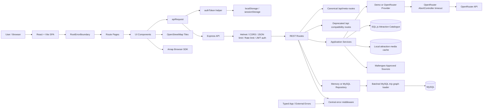
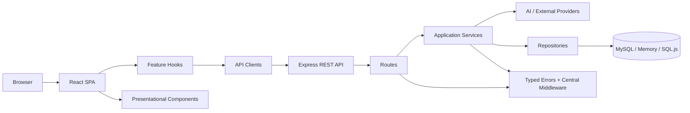
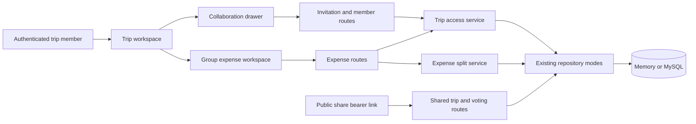

# Current Architecture

Date: 2026-07-24

Nuogo is a bilingual AI-assisted smart travel planner for domestic travel in mainland China. It is a pragmatic full-stack Final Year Project prototype: React/Vite frontend, Express REST API, shared Zod contracts, memory or MySQL trip storage, a local SQL.js/SQLite attraction catalogue, deterministic demo generation, and optional OpenRouter live AI generation.

The current architecture is a modular monolith. It does not use microservices, job queues, CQRS, event sourcing, Kubernetes, or a separate API gateway.

## 1. Project Overview

Implemented user-facing capabilities:

- Chinese-first bilingual UI with English/Chinese switching.
- Guest login, registration, login, and current-user hydration.
- Structured China-only travel preference form.
- Generation of three itinerary variants: budget, food, and leisure.
- Plan comparison and preferred-variant selection.
- Editable itinerary workspace with day tabs, activity cards, details dialog, drag reorder, budget panel, guide panel, route map, favorites, sharing, voting, duplication, archive, and partial regeneration.
- Huangshan/Anhui attraction grounding from approved local catalogue records.
- Attraction image serving through trusted source URLs and local hydration.
- Leaflet/OpenStreetMap route map by default, optional browser Amap renderer when `VITE_AMAP_KEY` exists and locations are not estimated.
- Anime.js-based motion in frontend interactions.

Core technologies:

- Frontend: React 18, Vite, React Router, Tailwind CSS, Anime.js, Leaflet, dnd-kit, lucide-react.
- Backend: Node.js 20+, Express, Helmet, CORS, rate limiting, JWT, bcryptjs, Zod.
- Persistence: in-memory repository for demo mode; MySQL repository for live mode; SQL.js/SQLite for bounded attraction catalogue ingestion.
- AI: deterministic demo provider by default; optional OpenRouter Chat Completions provider.

## 2. Project Structure

```text
client/
  src/
    api/
      client.js
      authToken.js
    components/
      RootErrorBoundary.jsx
      RouteMap.jsx
      LeafletRouteMap.jsx
      AmapRouteMap.jsx
      Timeline.jsx
      ActivityCard.jsx
      BudgetPanel.jsx
      GuidePanel.jsx
    context/
    hooks/
    i18n/
    layout/
    pages/
    styles/
  tests/

server/
  src/
    app.js
    config.js
    index.js
    errors.js
    middleware/
    routes/
    services/
    providers/
    repositories/
    ingestion/
    data/
    cli/
  tests/

shared/
  constants.js
  schemas.js
  contracts.test.js

database/
  migrations/
  seeds/

docs/
```

Important responsibilities:

- `client/src/pages`: route-level screens and user workflows.
- `client/src/components`: reusable UI, maps, timeline, budget, guide, motion, and error boundary components.
- `client/src/api/client.js`: fetch wrapper, JSON error mapping, bearer token injection, and 401 token cleanup.
- `client/src/api/authToken.js`: centralized browser token access.
- `client/src/context`: auth, language, and trip cache state.
- `server/src/app.js`: Express app composition, middleware, route mounting, and central error handling.
- `server/src/errors.js`: small typed application/external-service error classes.
- `server/src/routes`: HTTP route handlers.
- `server/src/services`: validation, generator, prompt builder, parser, grounding, budget, auth, attraction catalogue/media.
- `server/src/providers`: `DemoPlanProvider` and `OpenRouterProvider`.
- `server/src/repositories`: `MemoryRepository` and `MySqlRepository`.
- `server/src/ingestion`: bounded Mafengwo source policy, robots/content checks, parser, and SQLite repository.
- `shared`: Zod schemas and fixed travel taxonomy shared across server/client.

## 3. Current Architecture Diagram



## 4. Request And Data Flow

### Authentication

1. Login/register/guest pages call `AuthContext`.
2. `AuthContext` calls `apiRequest()`.
3. Backend auth routes call `AuthService`.
4. Passwords are hashed or verified with bcryptjs.
5. JWT is returned to the frontend.
6. `client/src/api/authToken.js` stores the token in `localStorage`.
7. `apiRequest()` injects `Authorization: Bearer <token>`.
8. `/api/auth/me` hydrates the user on reload.
9. HTTP 401 responses clear the stored token.

This remains an accepted prototype risk because localStorage tokens are exposed to XSS. It is documented in `SECURITY_SETUP.md`.

### Itinerary Generation

1. The user submits validated travel preferences.
2. `POST /api/trips/generate` validates preferences and loads approved Huangshan attractions when needed.
3. `generateThreePlans()` starts budget, food, and leisure generation concurrently.
4. `DemoPlanProvider` or `OpenRouterProvider` generates each variant.
5. Provider output is parsed and validated by `parseItinerary()`.
6. Huangshan output is grounded by `validateGroundedItinerary()` against the approved catalogue.
7. Failed styles retry up to the configured generator retry limit and then return editable fallback variants.
8. The repository saves the trip and variants.
9. The frontend stores a trip cache in session storage and opens plan comparison.

### Itinerary Workspace

The workspace supports activity edit/add/delete/reorder, cheaper alternatives, activity regeneration, day regeneration, sharing, voting, favorites, and duplication. Server routes authenticate requests and repositories enforce trip ownership.

### Map And Media

- `RouteMap.jsx` reads `VITE_AMAP_KEY`.
- Amap is used only in the browser when a key exists and locations are verified.
- Leaflet/OpenStreetMap is the default fallback.
- Attraction images are served by `/api/attractions/:attractionId/image`.
- The media service validates image host, content type, redirect count, and file size before local hydration.

## 5. Frontend Architecture

Current frontend shape:

- `App.jsx` wraps the app in `RootErrorBoundary`, `LanguageProvider`, `AuthProvider`, and React Router.
- Pages still coordinate route-level workflows.
- UI components render the planner, comparison, route map, itinerary timeline, budget, guide, sharing, favorites, and modals.
- `apiRequest()` centralizes HTTP calls and error parsing.
- `authToken.js` centralizes token reads/writes/deletes.
- `LanguageContext` manages Chinese/English state.
- `TripContext` manages trip loading and session cache behavior.

Remaining frontend limitations:

- Some workflow logic still lives in `PlannerPage.jsx`, `ComparePage.jsx`, and `TripWorkspacePage.jsx`.
- There is no integrated browser E2E test command.
- Vite emits a chunk-size warning because the SPA imports map rendering, drag-and-drop, Anime.js, lucide icons, and application pages into one 575.22 kB JavaScript bundle.

## 6. Backend Architecture

Current backend shape:

- `index.js` loads config, selects repository/provider, creates attraction services, passes OpenRouter timeout config into `OpenRouterProvider`, and starts the app.
- `app.js` composes middleware, routes, and central error handling.
- `errors.js` defines `AppError`, `ExternalServiceError`, and `ExternalServiceTimeoutError`.
- Route handlers remain Express handlers and delegate to services/repositories.
- Services own validation, generation, prompt construction, parsing, grounding, budget calculations, auth, and attraction media/catalogue behavior.
- Providers generate itinerary data.
- Repositories encapsulate memory or MySQL persistence.

Central error handling:

- Zod errors become HTTP 400 with `VALIDATION_ERROR`.
- Typed errors use their `status` and `code`.
- Unknown errors become HTTP 500 with `INTERNAL_ERROR`.
- Stack traces are not included in JSON responses.

## 7. Database Architecture

Live MySQL tables:

- `users`
- `trips`
- `travel_preferences`
- `itinerary_variants`
- `trip_days`
- `activities`
- `trip_shares`
- `activity_votes`
- `favorites`

Attraction catalogue tables:

- `ingestion_sources`
- `scrape_jobs`
- `attractions`
- `attraction_images`
- `attraction_sources`

`MySqlRepository.listTrips(ownerId)` first fetches trip IDs owned by that user ordered by `updated_at DESC`, then uses `loadTrips(ids)`. The batched loader preserves the requested trip ID order by mapping results back to the input IDs.

Expected query count:

- `getTrip(id)`: up to 4 query groups: trip, variants, days, activities.
- `listTrips(ownerId)`: 1 owner-filter query plus up to 4 graph query groups.
- Query count is fixed relative to the number of variants and days for a loaded trip graph, but `listTrips()` still adds the initial owner-filter query. It is not a fully constant one-query operation.

Compatibility preserved:

- Variant ordering uses budget, food, leisure.
- Day ordering uses day number.
- Activity ordering uses sort order.
- Empty variants or empty days are preserved.
- JSON fields are parsed through the existing `parseJson()` helper.
- `selectedVariantId`, owner ID, dates, budget, and title fields remain in the returned shape.
- `getTrip()` returns one trip or `undefined`.
- `listTrips()` returns only trips from the requested owner because IDs are selected by `user_id` before graph loading.

## 8. AI Integration

OpenRouter configuration:

- `AI_PROVIDER=openrouter` selects `OpenRouterProvider` in `server/src/index.js`.
- `OPENROUTER_MODEL` is read in `server/src/config.js` and passed from `server/src/index.js` into `OpenRouterProvider`.
- `OPENROUTER_TIMEOUT_MS` is read and validated in `server/src/config.js`.
- `server/src/index.js` passes `timeoutMs: config.openRouterTimeoutMs` into `server/src/providers/openRouter.js`.

OpenRouter runtime behavior:

- `OpenRouterProvider` builds prompts through `server/src/services/promptBuilder.js`.
- Requests use the OpenRouter Chat Completions endpoint.
- The provider uses `AbortController` plus `setTimeout()` to abort long-running calls.
- Timeout errors throw `ExternalServiceTimeoutError` with `OPENROUTER_TIMEOUT`.
- Network errors throw `ExternalServiceError` with `OPENROUTER_NETWORK_ERROR`.
- Non-2xx responses throw `OPENROUTER_REQUEST_FAILED`.
- Malformed JSON envelopes throw `OPENROUTER_RESPONSE_INVALID`.
- Empty content throws `OPENROUTER_EMPTY_RESPONSE`.
- The generator retries provider failures per style and returns fallback variants when a style remains failed.

Prompt and output safety:

- System instructions and structured user data are separated.
- User preferences are serialized as JSON data.
- Catalogue text is explicitly described as untrusted data, not instructions.
- Long catalogue description fields are capped before being sent to the model.
- Output is parsed, validated against shared schemas, and grounded against the approved attraction catalogue when required.

## 9. External Integrations

| Service | Purpose | Consuming File | Current Handling |
| --- | --- | --- | --- |
| OpenRouter | Live AI itinerary generation | `server/src/providers/openRouter.js` | Server-side key, timeout, typed errors, generator retries/fallback |
| Mafengwo catalogue | Bounded Anhui/Huangshan attraction source | `server/src/ingestion/*` | Source policy, robots check, cache, parser contracts |
| Mafengwo images | Attraction image URL/source hydration | `server/src/services/attractionMedia.js` | Host allowlist, content type allowlist, redirect limit, 8 MiB cap |
| OpenStreetMap | Default route map tiles | `client/src/components/LeafletRouteMap.jsx` | Browser Leaflet renderer |
| Amap | Optional China browser map | `client/src/components/AmapRouteMap.jsx` | Uses `VITE_AMAP_KEY`; script load failure is currently quiet |
| Unsplash URLs | Demo support-stop media | `server/src/providers/demoProvider.js` | Illustrative media for meals/hotels/support stops |

No weather, flight, booking, payment, or live hotel API is implemented.

## 10. Security Review

| Status | Finding | Affected File | Explanation |
| --- | --- | --- | --- |
| Resolved locally | `.env.example` exposed a real-looking OpenRouter key | `.env.example` | Replaced with a placeholder. Manual credential rotation remains required in OpenRouter because local cleanup does not revoke the old key. |
| Accepted prototype risk | JWT stored in localStorage | `client/src/api/authToken.js`, `client/src/context/AuthContext.jsx` | Token access is centralized and 401 clears stale auth, but localStorage can be exposed by XSS. Keep for FYP demo; use stronger auth for production. |
| Mitigated | OpenRouter request timeout was missing | `server/src/config.js`, `server/src/index.js`, `server/src/providers/openRouter.js` | Added validated `OPENROUTER_TIMEOUT_MS`, `AbortController`, and typed timeout/provider errors. |
| Accepted by design | Shared-trip read is public by token | `server/src/routes/collaboration.js` | `GET /api/shared/:token` is intentionally public bearer-link sharing. Treat share tokens as private URLs. |
| Mitigated with residual risk | Prompt injection | `server/src/services/promptBuilder.js`, `server/src/services/parser.js`, `server/src/services/grounding.js` | Prompt separates system/data, labels catalogue text as untrusted, caps long descriptions, validates output, and grounds Huangshan IDs. LLM prompt injection cannot be considered fully solved. |
| No issue found | Browser exposure of OpenRouter key | `client/src` | OpenRouter key is not read by frontend code. |
| No issue found | Password hashing | `server/src/services/authService.js` | bcryptjs is used. |
| No issue found | SQL parameterization | `server/src/repositories/mysql.js` | Queries use placeholders and `execute`. |
| No issue found | Basic HTTP hardening | `server/src/app.js` | Helmet, CORS, JSON size limit, and rate limiting are present. |
| Remaining issue | No dedicated login/generation rate limits | `server/src/app.js` | Only a global rate limit exists. |
| Remaining issue | No integrated secret-scan script | `package.json` | Manual scan was run, but no reusable npm script exists. |

## 11. Architecture Quality Assessment

| Area | Score | Evidence |
| --- | ---: | --- |
| Separation of concerns | 3 | Routes, services, providers, repositories, and shared schemas exist; frontend pages and `demoProvider.js` still mix responsibilities. |
| Modularity | 4 | Provider/repository adapters are swappable and token/error helpers are centralized. |
| Maintainability | 3 | Docs and small boundaries improved; large demo provider and page workflow logic remain. |
| Scalability | 3 | MySQL mode and batched graph loading help, but generation is still request/response and no production queue/cache model exists. |
| Security | 4 | Secret placeholder cleanup, timeout, typed errors, validation, and docs improved; localStorage JWT remains a prototype risk. |
| Performance | 4 | MySQL trip graph loading no longer loops per variant/day; Vite 575.22 kB JavaScript bundle warning remains. |
| Reliability | 4 | OpenRouter calls now have timeout/error classification and generator fallback behavior remains. |
| Testability | 4 | Added focused tests for OpenRouter errors, auth cleanup, typed error middleware, prompt hardening, authz, and MySQL batching. No real MySQL/E2E tests yet. |
| Reusability | 3 | Shared schemas and adapters help; frontend workflow extraction remains. |
| Error handling | 4 | Central middleware maps typed errors and frontend has a root error boundary; route-level user messaging can still improve. |
| Code consistency | 3 | ES module style is consistent; some Chinese text in source remains mojibake. |
| Documentation | 4 | Current architecture, verification, security, API, and changes docs now describe the post-change state. |

## 12. Architecture Problems And Technical Debt

| Status | Severity | Affected File/Folder | Issue | Recommended Future Improvement |
| --- | --- | --- | --- | --- |
| Resolved | Former critical | `.env.example`, `SECURITY_SETUP.md` | Real-looking OpenRouter key was present in example env | Placeholder added; rotate old key manually |
| Resolved | Former medium | `server/src/providers/openRouter.js`, `server/src/config.js`, `server/src/index.js` | Missing OpenRouter timeout | Timeout and typed errors added |
| Resolved | Former medium | `server/src/repositories/mysql.js` | Nested trip graph loading | Batched loader added |
| Resolved with compatibility | Former medium | `server/src/app.js`, `server/src/routes/meta.js` | Metadata router mounted ambiguously at `/api/meta` and `/api` | Canonical routes kept; legacy routes explicit with deprecation header |
| Resolved | Former low | `server/package.json` | Duplicate `cheerio` and `sql.js` keys | Duplicate keys removed |
| Accepted prototype risk | Medium | `client/src/api/authToken.js` | JWT remains in localStorage | Keep for FYP; migrate to complete cookie/CSRF or short-lived-token strategy before production |
| Remaining issue | Medium | `server/src/providers/demoProvider.js` | Large file mixes route optimization, support stops, media, and generation | Split only after snapshot tests pin generated output |
| Remaining issue | Medium | `client/src/pages/*` | Pages still contain workflow/API orchestration | Extract hooks/API modules where repeated behavior appears |
| Remaining issue | Medium | `package.json` | No lint/typecheck scripts | Add ESLint and optional JSDoc/TypeScript checking |
| Remaining issue | Medium | `server/tests` | MySQL tests use mocked pool, not real MySQL | Add integration test against a disposable MySQL database |
| Remaining issue | Medium | `client` | No integrated browser E2E smoke test | Add Playwright smoke flow for login/generate/select/workspace |
| Remaining issue | Low | `client/dist` build output | Vite chunk-size warning: JavaScript bundle is 575.22 kB | Investigate route-level lazy loading and dependency chunking |
| Remaining issue | Low | `client/src/components/AmapRouteMap.jsx` | Amap script load failure is not surfaced to the user | Show non-blocking map-provider fallback reason |

## 13. Testing Status

Baseline before the architecture pass:

- `npm test`: passed.
- Shared: 4 tests.
- Server: 67 tests.
- Client: 26 tests.
- `npm run build`: passed with Vite chunk-size warning.
- `npm run lint`: not run because no root script existed.
- `npm run typecheck`: not run because no root script existed.

Final post-change verification:

- `npm test`: passed after the architecture pass.
- Shared: 4 tests.
- Server: 76 tests.
- Client: 29 tests.
- `npm run build`: passed after the architecture pass.
- Vite chunk-size warning remains: generated JavaScript bundle is 575.22 kB after minification.
- `npm run lint`: no root script exists.
- `npm run typecheck`: no root script exists.

New or strengthened test coverage:

- OpenRouter timeout, non-2xx, malformed JSON envelope, and empty-content responses.
- OpenRouter timeout configuration.
- Cross-user trip/activity authorization.
- Typed server error middleware mapping.
- Prompt hardening for untrusted catalogue text.
- MySQL batched trip graph loading.
- Frontend token injection and 401 cleanup.
- Root error boundary rendering.

## 14. Bundle Warning Review

Latest Task 12 build output contains one JavaScript bundle of 575.22 kB (176.75 kB gzip) and one CSS bundle of 58.55 kB (15.57 kB gzip). No sourcemap/metafile report is configured.

Likely contributors from direct imports:

- Leaflet is imported by `LeafletRouteMap.jsx` and is part of the main bundle.
- dnd-kit is imported by `Timeline.jsx` and `ActivityCard.jsx`.
- Anime.js is imported by `useAnime.js`.
- lucide-react icons are imported across many pages/components but should be tree-shaken per named import.
- Amap itself is loaded from an external script only when `VITE_AMAP_KEY` exists; the SDK is not bundled.
- Application code is all statically routed in `App.jsx`, so every page enters the main bundle.

No route-level lazy loading was applied in this pass because it is an optimization, not a correctness fix.

## 15. Target Architecture

The target remains a pragmatic modular monolith:



Recommended direction:

- Add feature hooks only where they reduce repeated frontend workflow code.
- Add controller/service extraction only for complex route handlers.
- Keep provider/repository modes unchanged.
- Avoid adding a background job queue unless live generation latency or reliability proves request/response is insufficient.

## 16. Prioritised Improvement Plan

Completed in the 2026-07-24 architecture pass:

- Replace exposed example OpenRouter key with placeholder and document rotation.
- Add `SECURITY_SETUP.md`.
- Add OpenRouter timeout and typed provider errors.
- Add typed error classes and middleware integration coverage.
- Make metadata compatibility routes explicit and deprecated.
- Centralize frontend token storage and clear auth on 401.
- Add a root frontend error boundary.
- Batch MySQL trip graph loading.
- Remove duplicate dependency keys.
- Strengthen prompt catalogue text handling.

Remaining plan:

| Priority | Improvement | Reason |
| --- | --- | --- |
| P1 | Add real MySQL integration testing | Mocked pool tests do not prove migration/runtime compatibility. |
| P2 | Add ESLint | No current lint script catches style/import issues. |
| P2 | Add integrated browser E2E smoke test | Root tests do not exercise the full browser flow. |
| P2 | Investigate Vite bundle size | Build warning remains with a 575.22 kB JavaScript bundle. |
| P2 | Extract repeated frontend workflow logic | Pages still coordinate API/session/navigation logic directly. |
| P3 | Split `demoProvider.js` after snapshot tests | It is large, but generated output should be pinned before splitting. |
| P3 | Consider stronger production authentication | localStorage JWT is acceptable for FYP but not ideal for production. |
| P3 | Surface map provider failure reasons | Amap load failure is currently quiet. |

## 17. Files To Share For External Architecture Review

Core configuration and docs:

- `package.json`
- `client/package.json`
- `server/package.json`
- `shared/package.json`
- `.env.example`
- `README.md`
- `docs/API.md`
- `PRODUCT.md`
- `DESIGN.md`
- `ARCHITECTURE_VERIFICATION.md`
- `ARCHITECTURE_CHANGES.md`
- `SECURITY_SETUP.md`
- `CURRENT_ARCHITECTURE.md`

Frontend:

- `client/src/main.jsx`
- `client/src/App.jsx`
- `client/src/api/client.js`
- `client/src/api/authToken.js`
- `client/src/components/RootErrorBoundary.jsx`
- `client/src/context/AuthContext.jsx`
- `client/src/context/TripContext.jsx`
- `client/src/context/LanguageContext.jsx`
- `client/src/pages/PlannerPage.jsx`
- `client/src/pages/ComparePage.jsx`
- `client/src/pages/TripWorkspacePage.jsx`
- `client/src/components/PreferenceForm.jsx`
- `client/src/components/PlanComparison.jsx`
- `client/src/components/Timeline.jsx`
- `client/src/components/ActivityCard.jsx`
- `client/src/components/BudgetPanel.jsx`
- `client/src/components/RouteMap.jsx`
- `client/src/components/LeafletRouteMap.jsx`
- `client/src/components/AmapRouteMap.jsx`
- `client/src/components/CollaborationDrawer.jsx`
- `client/src/components/MemberAvatars.jsx`
- `client/src/components/ExpenseWorkspace.jsx`
- `client/src/components/ExpenseDialog.jsx`
- `client/src/components/SettlementList.jsx`
- `client/src/pages/InvitationPage.jsx`
- `client/tests/api-client.test.jsx`
- `client/tests/collaboration-archive.test.jsx`
- `client/tests/group-expenses.test.jsx`
- `client/tests/invitation.test.jsx`
- `client/tests/root-error-boundary.test.jsx`

Backend:

- `server/src/index.js`
- `server/src/app.js`
- `server/src/config.js`
- `server/src/errors.js`
- `server/src/routes/*.js`
- `server/src/middleware/auth.js`
- `server/src/services/authService.js`
- `server/src/services/generator.js`
- `server/src/services/promptBuilder.js`
- `server/src/services/parser.js`
- `server/src/services/grounding.js`
- `server/src/services/budget.js`
- `server/src/services/tripAccess.js`
- `server/src/services/invitationTokens.js`
- `server/src/services/expenseSplit.js`
- `server/src/routes/members.js`
- `server/src/routes/expenses.js`
- `server/src/providers/openRouter.js`
- `server/src/providers/demoProvider.js`
- `server/src/repositories/memory.js`
- `server/src/repositories/mysql.js`
- `server/src/ingestion/*.js`
- `server/tests/api.test.js`
- `server/tests/collaboration-api.test.js`
- `server/tests/openrouter-provider.test.js`
- `server/tests/repository-contract.test.js`

Database and shared contracts:

- `shared/schemas.js`
- `shared/constants.js`
- `database/migrations/001_initial.sql`
- `database/migrations/002_anhui_ingestion.sql`
- `database/migrations/003_grounded_activity_sources.sql`
- `database/migrations/004_activity_media_details.sql`
- `database/migrations/005_trip_collaboration_expenses.sql`
- `database/seeds/001_demo.sql`

## 18. Post-Baseline Collaboration And Expense Extension

Status: implemented after the pragmatic architecture baseline was frozen. This is a feature extension inside the existing modular monolith, not an architecture rewrite.

The technology and deployment boundaries remain unchanged:

- React and Vite remain the single frontend application.
- Express remains the single HTTP API.
- Memory and MySQL repository modes remain supported.
- Shared Zod schemas remain the request and response contract boundary.
- Authentication remains bearer JWT for the FYP prototype.
- Public bearer-link sharing remains available and separate from authenticated trip membership.



### Extension Modules

Backend routes:

- `server/src/routes/members.js` owns invitation creation, inspection, acceptance, decline, revocation, member role changes, removal, and activity-log reads.
- `server/src/routes/expenses.js` owns expense CRUD and settlement-summary reads.
- Existing trip and activity routes enforce optimistic concurrency with `expectedRevision` and return `TRIP_VERSION_CONFLICT` for stale writes.

Services and contracts:

- `server/src/services/tripAccess.js` resolves `owner`, `editor`, and `viewer` access.
- `server/src/services/invitationTokens.js` creates high-entropy invitation tokens and stores only SHA-256 hashes.
- `server/src/services/expenseSplit.js` performs deterministic integer-fen splitting and settlement reconciliation.
- `shared/schemas.js` contains member, invitation, revision, expense, and expense-summary schemas.

Frontend surfaces:

- `client/src/pages/InvitationPage.jsx` handles invitation preview and acceptance states.
- `client/src/components/CollaborationDrawer.jsx` manages members and pending invitations.
- `client/src/components/MemberAvatars.jsx` shows active collaborators in the workspace header.
- `client/src/components/ExpenseWorkspace.jsx` keeps planned itinerary budget and actual group expenses as separate views.
- `client/src/components/ExpenseDialog.jsx` defaults to equal splitting and allows travellers to be excluded.
- `client/src/components/SettlementList.jsx` shows paid, share, net, and settlement instructions.

Persistence added by `database/migrations/005_trip_collaboration_expenses.sql`:

- `trips.revision`
- `trip_members`
- `trip_invitations`
- `trip_expenses`
- `expense_participants`
- `trip_activity_log`

The invitation token hash is stored in `trip_invitations`; plaintext tokens are returned only at creation. Expense amounts and participant shares are stored as integer fen. Collaboration mutations are scoped to active membership, and itinerary writes use per-trip revision checks.

### Current Verification

The complete shared, server, and client test suites cover collaboration contracts, role authorization, invitation state transitions, revision conflicts, repository transactions, expense reconciliation, and responsive frontend behavior. The fresh Task 12 run passed 12 shared, 151 server, and 101 client tests (264 total). The production build emits one JavaScript bundle of 575.22 kB (176.75 kB gzip) and one CSS bundle of 58.55 kB (15.57 kB gzip); the existing Vite chunk-size warning remains a performance follow-up and was not optimized during this documentation pass.
