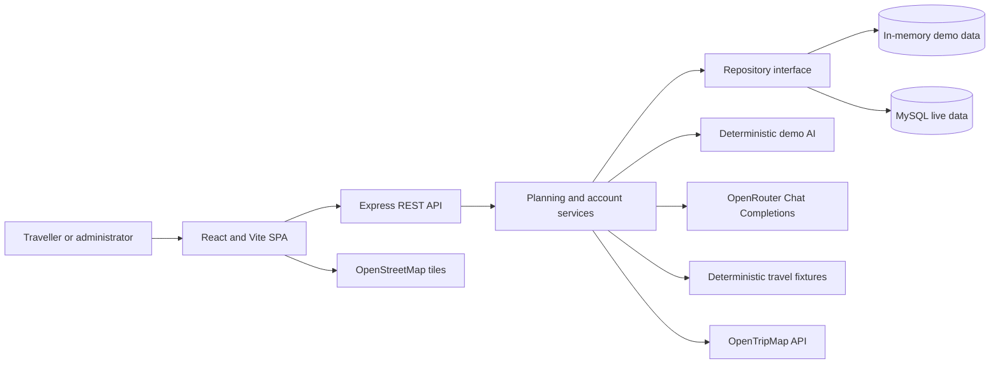
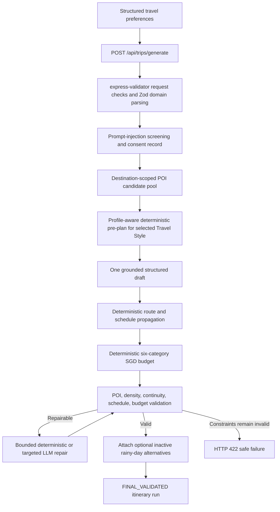

# Nuogo Current Architecture

Verified baseline: 2026-09-04

This document describes the current executable system. Earlier architecture, ingestion, collaboration, guide, and visual-design documents are historical project evidence only.

## 1. Product Scope

Nuogo is a Chinese-first, bilingual smart travel planner for Singapore. The assessed prototype implements:

1. Security and privacy controls for accounts, preferences, and saved trips.
2. One constraint-aware itinerary for the traveller's selected Travel Style under one hard budget.
3. Grounded tourism information with retained provider and cost provenance.

The system does not implement booking, payment, live ticket inventory, tour guides, social collaboration, shared expenses, public trip sharing, or nationwide planning.

## 2. Architecture Style

Nuogo is a modular monolith with three npm workspaces:

- `client`: React/Vite single-page application.
- `server`: Express REST API and application services.
- `shared`: Zod contracts, JSON Schema, and fixed travel taxonomy.

There are no microservices, queues, CQRS, event sourcing, or separate API gateway.

## 3. System Context

## 4. Frontend

`client/src/App.jsx` defines these routes:

| Route | Purpose | Access |
| --- | --- | --- |
| `/` | Animated landing journey | Public |
| `/login`, `/register` | Account and guest entry | Public |
| `/planner` | Structured preference form | Public; creates guest session when required |
| `/discover/:destination` | Singapore attraction discovery and MANUAL/AUTO choice | Public |
| `/trip/:tripId` | Generated itinerary workspace | Authenticated owner |
| `/archive` | Saved trips | Authenticated owner |
| `/profile` | Profile, password, language, account deletion | Authenticated user |
| `/admin` | Supporting destination, POI, and cost-reference maintenance | Administrator |

Chinese is the default language. `LanguageContext.jsx` persists an explicit Chinese or English choice. `AuthContext.jsx` hydrates `/api/auth/me`, while `apiRequest()` injects the JWT and clears an expired session on HTTP 401.

The active planning UI uses `DestinationDiscoveryPage.jsx`, `PreferenceForm.jsx`, `ObjectiveTripWorkspace.jsx`, `RainyDayBackup.jsx`, `LeafletRouteMap.jsx`, and `PrivacyDialog.jsx`. Anime.js, GSAP, and Three.js provide motion; Leaflet renders the itinerary map.

## 5. API Composition

`server/src/app.js` applies Helmet, origin-restricted CORS, a 100 KB JSON limit, global rate limiting, JWT authentication, and centralized error handling. It mounts only:

- `/api/auth`
- `/api/admin`
- `/api/meta`
- `/api/trips`
- `/api/profile`
- `/api/privacy`

Legacy attraction, collaboration, invitation, expense, favorite, vote, share, guide, and ingestion routes are not present.

## 6. Generation Pipeline

The AI proposes a constrained draft only. It does not authoritatively calculate routes, schedules, prices, totals, or validation results.

## 7. Travel Style Selection

Before generation, the traveller selects one of:

- `BUDGET_SAVING`
- `BALANCED`
- `COMFORT_FOCUSED`

`spendingProfiles.js` defines each style's tier, pace, route mode, and soft allocation preferences. `generateValidatedTrip.js` generates only the selected style, and `budgetMinor` in SGD cents is a hard ceiling for every style. When enabled, `rainyDayBackup.js` attaches an optional grounded contingency without replacing or altering the main activity; no weather detection or automatic substitution occurs.

## 8. Budget Engine

`budgetEngine.js` calculates integer SGD-cent values for:

1. Accommodation.
2. Local transportation.
3. Food and beverages.
4. Attraction tickets.
5. Entertainment and activities.
6. Miscellaneous expenses.

It also derives total, remaining budget, exceeded amount, and per-person cost. Cost references are repository records with range, representative value, tier, source URL, source name, collection date, and status. Demo fixtures are explicitly non-live evidence.

## 9. Tourism Grounding

`DemoTravelProvider` supplies deterministic test/demo records. `OpenTripMapProvider` is the sole live tourism provider. The server normalizes provider records into a candidate pool and retains source IDs, URLs, retrieval times, coordinates, categories, match status, and verification status.

Only candidate IDs in the destination-scoped pool can become grounded itinerary activities. Unknown or unsupported POIs fail validation. Origin, hotel, and destination anchors can be system estimates and are labelled as such.

## 10. Authentication And Authorization

- Registered passwords use bcryptjs with 12 rounds.
- JWT bearer tokens expire after seven days.
- Guest identities and session trips expire no later than 24 hours after their latest authenticated activity.
- Guest trips do not appear in archives. A one-time server-verified claim token is required to explicitly save one guest itinerary after registration or login.
- Trip access is owner-only in the final scope.
- The server verifies the administrator role for every `/api/admin` request.
- Suspended users are rejected by authentication middleware.
- Profile password changes and registered-account deletion require the current password.

The frontend stores registered JWTs in `localStorage` and guest JWTs in `sessionStorage`; this is an accepted FYP prototype risk documented in `SECURITY_SETUP.md`.

## 11. Runtime Modes

| Mode | Repository | Default AI | Default tourism data |
| --- | --- | --- | --- |
| `demo` | Memory | Deterministic demo provider | Deterministic demo provider |
| `test` | Explicit injected test repository | Test-controlled | Test-controlled |
| `live` | MySQL | OpenRouter | OpenTripMap |

`initializeDemoRuntime.js` seeds only missing demo cost references. An administrator is seeded only when both optional demo-admin variables are provided. Those variables are ignored in live mode.

## 12. Persistence

The final MySQL model retains these active tables after migration `015_remove_retired_subsystems.sql`:

- `users`, `privacy_consents`
- `trips`
- `supported_destinations`
- `canonical_pois`, `poi_source_records`
- `route_cache`, `cost_references`
- `itinerary_runs`, `trip_legs`
- `itinerary_provenance`, `itinerary_validation_issues`, `itinerary_repairs`
- `admin_system_records`

Trip objective data is stored in `trips.objective_payload_json`; run-level validation, provenance, legs, and repair evidence use dedicated tables. Migration `016_singapore_report_alignment.sql` adds Singapore references and guest expiry/claim fields. Existing physical `_fen` columns remain a compatibility boundary only; repositories expose generic minor-unit fields and preserve archived CNY semantics.

## 13. Administration

The logical `SYSTEM_ADMIN` role is represented by `users.role = 'admin'`; there is no separate administrator table. System Administrators can maintain Singapore destination status, canonical Points of Interest (POIs), and cost-reference evidence. User, provider-record, and system-record management are outside the supporting-admin scope and are not exposed by active routes.

Generation reads cost references from the repository in both demo and live modes, so saved administrative changes affect subsequent plans.

## 14. External Services

| Service | Boundary | Current status |
| --- | --- | --- |
| OpenRouter | Server-side structured draft generation with timeout and typed errors | Implemented; live execution is opt-in |
| OpenTripMap | Server-side destination POI retrieval/detail calls with timeout and retry | Implemented; live execution is opt-in |
| OpenStreetMap | Browser map tiles through Leaflet | Active display dependency |
| Unsplash | Remote illustrative UI images | Non-authoritative presentation media |

No credential is sent to the browser except public third-party media/tile requests that require no Nuogo secret.

## 15. Testing

- Shared contract tests validate taxonomies and schemas.
- Server tests cover auth, authorization, request validation, generation, budgets, provider adapters, repair, persistence contracts, administration, and privacy.
- Client tests cover pages, localization, discovery, the one-itinerary workspace, maps, optional rainy-day presentation, and error states.
- Playwright covers desktop/mobile landing motion and the critical user journey; a desktop administrator journey verifies that revised cost evidence appears in subsequent generation provenance.
- MySQL, OpenTripMap, and OpenRouter integration tests are opt-in and skip without explicit test flags and credentials.

Fresh acceptance counts are produced by the commands above; superseded audit snapshots retain their original historical results.

On 2026-09-04, `npm test` passed 346 tests: 10 shared, 242 server, and 94 client. Playwright passed 14 checks and skipped 4 project-scoped checks. `npm run lint` completed with zero errors and five pre-existing React Hook dependency warnings. Live MySQL, OpenTripMap, and OpenRouter checks were not executed because their explicit integration credentials and flags were unavailable.

The 2026-09-04 build produced a 670.79 kB main JavaScript bundle (216.72 kB gzip), a 529.46 kB Living Atlas chunk (134.64 kB gzip), and 77.53 kB of CSS (19.72 kB gzip).

## 16. Known Limits

- Live provider and MySQL behavior cannot be claimed without an opt-in run against configured external systems.
- Costs are estimates, not live quotations or booking inventory.
- There are no adult/child/senior ticket products.
- Route legs are estimates, not turn-by-turn navigation.
- JWT localStorage and one global rate limiter are prototype tradeoffs.
- The production frontend currently emits a Vite chunk-size warning.

## 17. Authoritative References

- `client/src/App.jsx`
- `client/src/context/LanguageContext.jsx`
- `client/src/components/PreferenceForm.jsx`
- `client/src/components/ObjectiveTripWorkspace.jsx`
- `client/src/components/RainyDayBackup.jsx`
- `server/src/app.js`
- `server/src/config.js`
- `server/src/index.js`
- `server/src/runtime/initializeDemoRuntime.js`
- `server/src/services/itinerary/generateValidatedTrip.js`
- `server/src/services/budget/budgetEngine.js`
- `server/src/services/validation/validationEngine.js`
- `server/src/providers/openRouter.js`
- `server/src/providers/travel/openTripMapProvider.js`
- `server/src/repositories/memory.js`
- `server/src/repositories/mysql.js`
- `shared/constants.js`
- `shared/schemas.js`
- `shared/itineraryDraftSchema.js`
- `database/migrations/015_remove_retired_subsystems.sql`
- `database/migrations/016_singapore_report_alignment.sql`
- `docs/API.md`
- `docs/FRONTEND_ERD_TRACEABILITY.md`
- `docs/REPORT_IMPLEMENTATION_TRACEABILITY.md`
- `docs/REPORT_PATCH_LIST_SINGAPORE.md`
- `SECURITY_SETUP.md`
