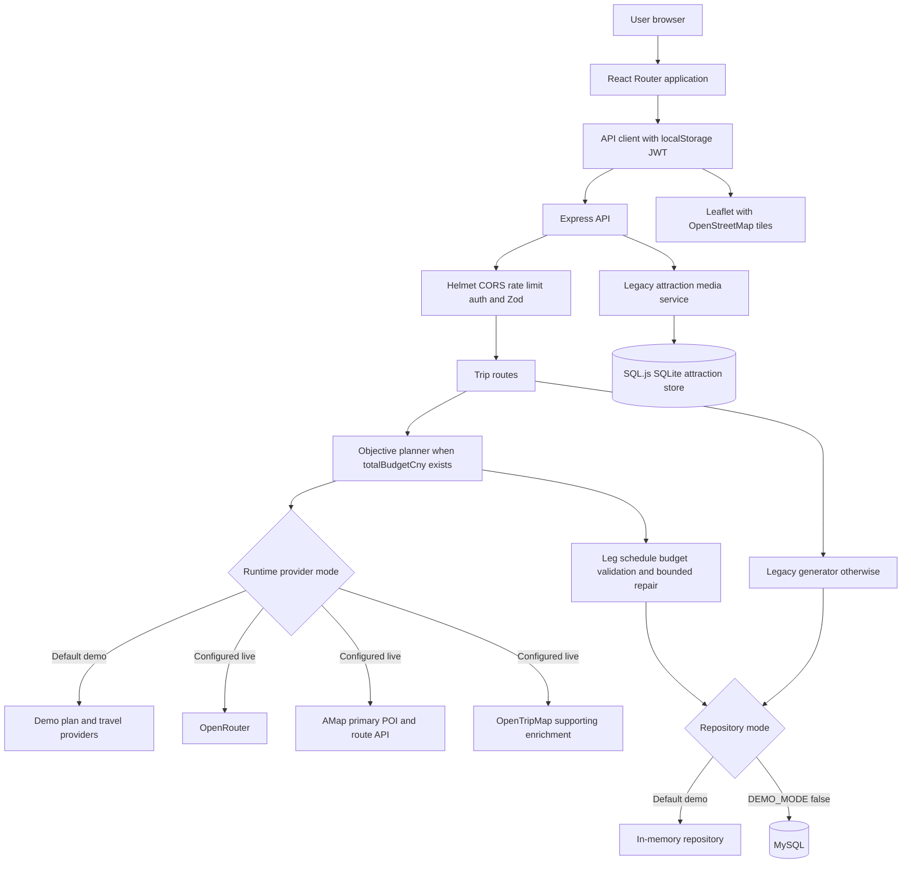

# Nuogo Current System Architecture and Workflow Audit

**Audit date:** 2026-08-21  
**Audit type:** Read-only repository and runtime audit  
**Evidence basis:** Current working tree, not only committed files or prior architecture documents

## 1. Executive Summary

Nuogo is a JavaScript npm-workspace monorepo with a React/Vite frontend, an Express backend, and shared Zod contracts. The current default runtime is a **demo system**: it uses an in-memory repository, a deterministic demo plan provider, synthetic travel data, and hard-coded cost references. A MySQL repository, OpenRouter provider, AMap provider, and OpenTripMap provider are implemented and selected by environment configuration, but they are not used by the currently running default configuration.

The active objective-aligned workflow supports Beijing, Shanghai, and Xi'an, generates three independently drafted spending-profile variants, validates and repairs them, enforces the same hard total budget, persists them through the selected repository, and displays comparison and itinerary workspaces. In demo mode this is end-to-end functional but synthetic. In live mode the code is designed to use AMap as the primary POI/route source and OpenTripMap only as optional supporting enrichment.

The repository also retains a second, legacy itinerary system plus Huangshan/Mafengwo ingestion, SQLite attraction/media storage, collaboration, expense splitting, public sharing, favorites, tour-guide UI, and broad China constants. Some of these features are active in APIs, some are hidden for objective-aligned trips, and some are gated by legacy flags. This creates duplicated schemas, generation paths, budget engines, and persistence concepts.

Critical findings:

- OpenTripMap is not the authoritative source. The candidate pool accepts AMap-only records; the default runtime uses synthetic demo records instead of either external provider (`server/src/index.js:30-40`; `server/src/services/poi/buildCandidatePool.js:28-45`).
- Prompt-injection screening exists as a service but is not called by the active generation route or generation pipeline (`server/src/services/promptInjection.js`; `server/src/routes/trips.js:60-86`). Prompt data separation is present, but screening is **UNUSED**.
- Objective-aligned generation is structurally and semantically validated, but operating hours, real hotel selection/check-in, full daily meal scheduling, route geometry display, and global route optimization are not implemented.
- Current default persistence is volatile memory. MySQL is implemented and tested with fake pools, but a live MySQL execution was not verified in this audit (`server/src/index.js:18-21`).
- The objective-aligned workspace bypasses the legacy activity editor, collaboration drawer, expense UI, favorites, and tour-guide UI (`client/src/pages/TripWorkspacePage.jsx:131-133`).
- Unit/integration suites pass: **414/414 tests**. The production build passes. Browser E2E fails: **22/22 tests failed**, primarily because tests still query English labels while Chinese is now the default language.

## 2. Repository State

| Item | Current state | Evidence |
| --- | --- | --- |
| Git branch | `main` | `git branch --show-current` |
| Commit | `8cece621b44f794147005e44ec619565cd32083e` | `git rev-parse HEAD` |
| Working tree | Dirty before this report | `git status --short` |
| Major modified areas | Objective UI, language, generation, budget, repair, and their tests | `client/src/components/*`, `client/src/pages/*`, `server/src/services/*`, `server/tests/*` in `git status --short` |
| Major untracked areas | Local skills/config, audits, plans/specs, two current implementation files | `.agents/`, `.codex/`, `docs/audits/`, `docs/superpowers/`, `server/src/services/itinerary/buildVariantMetrics.js`, `server/src/services/validation/validators/spendingProfileValidator.js` |
| Node | `v20.15.1` | Executed `node --version` |
| npm | `10.7.0` | Executed `npm --version` |
| Package layout | npm workspaces: `client`, `server`, `shared` | `package.json:6-10` |
| Required Node range | `>=20` | `package.json:11-13` |
| Current `.env` | Not present | `Test-Path .env` returned `False` |
| `.env.example` | Tracked but currently empty (0 bytes) | filesystem inspection and `git status --short` |

The audit did not create a commit and did not alter application files. Because the tree was already dirty, all findings describe the working tree rather than only commit `8cece62`.

## 3. Repository Structure

```text
/
|-- client/                 React application, components, pages, contexts, tests
|-- server/                 Express API, providers, services, repositories, tests
|-- shared/                 Zod schemas, constants, shared contract tests
|-- database/
|   |-- migrations/         MySQL application schema and objective/legacy additions
|   |-- seeds/              Demo/reference data
|   `-- local/              Default SQL.js attraction database path
|-- tests/e2e/              Playwright browser tests
|-- scripts/                Node bootstrap and utility scripts
|-- docs/                   Architecture, audit, design, API, plans and specifications
|-- assets/                 Product visual assets
|-- package.json            Workspace orchestration
`-- playwright.config.js    Browser test configuration
```

`dist/`, `.artifacts/`, worktrees, tools, and local skill/config directories are support/generated content rather than runtime source modules.

## 4. Actual Technology Stack

| Area | Proposal target | Actual repository | Evidence | Match? |
| --- | --- | --- | --- | --- |
| Frontend | React web UI | React 18.3.1 | `client/package.json:20-21` | Yes |
| Build tool | Vite | Vite 5.4.10 | `client/package.json:34` | Yes |
| Styling | Tailwind CSS | Tailwind 3.4.14 plus project CSS | `client/package.json:33`; `client/src/styles/index.css` | Yes |
| Bootstrap | Not required by current architecture | Not installed or used | package manifests | No conflict |
| Backend | Node.js/Express | Node >=20, Express 4.21 | `package.json:11-13`; `server/package.json:21` | Yes |
| Main database | MySQL | MySQL repository exists; default runtime uses memory | `server/src/index.js:18-21`; `server/src/repositories/mysql.js` | Partial |
| Secondary database | None in target workflow | SQL.js/SQLite attraction store is instantiated on every startup | `server/package.json:26`; `server/src/index.js:69-74` | Conflicting/legacy |
| AI gateway | OpenRouter | Implemented, optional; demo provider is default | `server/src/config.js:6,48-52`; `server/src/index.js:22-29` | Partial/demo by default |
| Actual model | Configurable OpenRouter model | No model used in default runtime; live default is `openai/gpt-4.1-mini` | `server/src/config.js:50` | Partial |
| Tourism source | OpenTripMap | Supporting enrichment only; demo equivalent by default | `server/src/index.js:30-40`; `openTripMapProvider.js:22-39` | Partial/conflicting |
| China POI/route source | Not the stated OpenTripMap-only target | AMap is primary in live mode | `amapProvider.js:74-128`; `generateValidatedTrip.js:33-58` | Conflicting |
| Map | Leaflet/OpenStreetMap | Leaflet 1.9.4 with OSM tiles | `client/package.json:18`; `LeafletRouteMap.jsx:51-75` | Yes |
| Validation | Structured validation | Zod 3.23.8 | `shared/package.json:15`; `server/package.json:27` | Yes, implementation differs from express-validator/Ajv wording |
| express-validator | Sometimes named in proposal drafts | Not installed or imported | manifests and repository search | No |
| Ajv | Sometimes named for JSON schema | Not installed or imported | manifests and repository search | No |
| Authentication | JWT and password hashing | jsonwebtoken 9; bcryptjs 2.4 | `server/package.json:17,24`; `authService.js:16-44` | Yes |
| HTTP security | Helmet, CORS, rate limit | All configured globally | `server/src/app.js:34-42` | Yes |
| Unit/component tests | Vitest | Vitest in all three workspaces | package manifests | Yes |
| API tests | Supertest | Supertest 7 | `server/package.json:30` | Yes |
| Browser tests | Playwright | Playwright 1.62.1 | `package.json:28`; `playwright.config.js` | Yes |
| Motion/3D | Product enhancement | animejs, GSAP and Three are present | `client/package.json` | Additional |

## 5. Current High-Level Architecture

### 5.1 Frontend

- Entry: `client/src/main.jsx:1-9` mounts `<App />`.
- Routing: `client/src/App.jsx:15-28` defines landing, login, registration, invitation, planner, comparison, trip, archive, and optional public-share routes.
- Global state: `AuthContext` manages user/token bootstrapping; `LanguageContext` defaults to Chinese and persists language; `TripContext` loads and updates trip/member state. There is no Redux-style store.
- API client: `client/src/api/client.js:3-24` uses `VITE_API_URL` or `/api`, attaches a bearer token, and clears it after a 401. `client/src/api/authToken.js:1-19` stores the token in `localStorage`.
- Generation: `PlannerPage.jsx:32-54` establishes a demo guest when necessary, posts `/trips/generate`, caches the result in session state, and navigates to comparison.
- Comparison: `ComparePage.jsx:17-45` posts a selected variant to `/trips/:id/select-variant` and navigates to the trip workspace.
- Objective workspace: `ObjectiveTripWorkspace.jsx:118-223` displays the selected variant, budget, source records, schedule, legs, detail modal, and Leaflet map. Rename, regenerate, and delete make real API calls.
- Legacy workspace: `TripWorkspacePage.jsx:131-133` immediately delegates objective trips to the objective workspace. Activity-level editing, guide, collaboration, expenses, favorites, and legacy maps below that branch are therefore not shown for current objective trips.
- Administration: no frontend admin route or page exists in `client/src/App.jsx`.

### 5.2 Backend

- Entry/composition: `server/src/index.js:18-85` chooses repositories/providers and constructs the planner and Express app.
- Middleware/routes: `server/src/app.js:34-101` mounts Helmet, CORS, body limit, rate limiting, auth, admin, metadata, trips, activities, members, expenses, favorites, privacy, optional legacy collaboration, and attraction media.
- Authentication: `AuthService` validates with shared Zod schemas, hashes with bcrypt cost 12, signs 7-day JWTs, and creates unique demo guests (`authService.js:16-54`).
- Authorization: `trips.js` and related routers use `authenticate`, `getTripAccess`, and `requireTripRole`; admin uses authenticated role authorization (`server/src/routes/admin.js:62-65`).
- Objective generation: `generateValidatedTrip()` retrieves/normalizes candidates, drafts three variants, builds route legs and schedules, calculates budget, validates, repairs, checks cross-variant differentiation, and returns only a final validated trip (`server/src/services/itinerary/generateValidatedTrip.js:33-260`).
- Legacy generation: `generateThreePlans()` remains in `server/src/services/generator.js:84-107`; `POST /api/trips/generate` selects it when the body lacks `totalBudgetCny` (`server/src/routes/trips.js:60-86`).
- Error/logging: internal errors are logged and redacted; clients receive a generic message (`server/src/app.js:110-133`; `server/src/services/logger.js:1-26`).

There is no separate controller layer. Route handlers call schemas, services, and repositories directly.

### 5.3 Shared Layer

- `shared/schemas.js:38-84` defines the strict objective travel preference contract.
- `shared/schemas.js:86-159` defines canonical POIs, source records, trip legs, and itinerary drafts.
- The same file retains legacy preference, activity, itinerary variant, collaboration, and expense schemas after the objective contracts (`shared/schemas.js:177 onward`).
- `shared/constants.js:19-22` defines the active supported destinations, while older city constants remain in the same module.
- `shared/itineraryDraftSchema.js` supplies the strict structured-output schema used by OpenRouter.

### 5.4 Data Layer

Three persistence modes/concepts coexist:

1. **MemoryRepository**: selected whenever `DEMO_MODE` is not exactly `false`; current default and running mode (`server/src/index.js:18-21`). Data disappears on API restart.
2. **MySqlRepository**: selected in live mode; supports users, trips, objective payloads, collaboration, expenses, admin reference data, provenance, and validation records (`server/src/repositories/mysql.js`).
3. **SQL.js/SQLite attraction repository**: instantiated regardless of demo/live mode for legacy attraction catalogue and media (`server/src/index.js:69-74`; `server/src/ingestion/sqliteRepository.js`).

Important MySQL schema groups:

| Group | Tables/migration | Nature |
| --- | --- | --- |
| Core legacy travel | `users`, `trips`, `travel_preferences`, `itinerary_variants`, `trip_days`, `activities` | `database/migrations/001_initial.sql:7-109` |
| Sharing/favorites | `trip_shares`, `activity_votes`, `favorites` | `001_initial.sql:110-145` |
| Anhui ingestion | `ingestion_sources`, `scrape_jobs`, `attractions`, `attraction_images`, `attraction_sources` | `002_anhui_ingestion.sql` (duplicated conceptually by SQL.js runtime store) |
| Collaboration/expenses | `trip_members`, `trip_invitations`, `trip_expenses`, `expense_participants`, `trip_activity_log` | `005_trip_collaboration_expenses.sql` |
| Privacy | user soft-delete fields and `privacy_consents` | `006_security_privacy.sql` |
| Objective pipeline | `supported_destinations`, `canonical_pois`, `poi_source_records`, `route_cache`, `cost_references`, `itinerary_runs`, `trip_legs`, `itinerary_provenance`, `itinerary_validation_issues`, `itinerary_repairs` | `007_objective_aligned_mvp.sql:4-126` |
| Objective scope data | three supported destinations and reference/POI data | `008_objective_aligned_seed.sql` |
| Objective payload | JSON payload column on `trips` | `009_objective_trip_payload.sql` |

Production versus demo distinction:

- **Current runtime data:** memory users/trips, `DemoTravelProvider` POIs/routes, `DemoPlanProvider` drafts, and hard-coded references (`server/src/index.js:30-57`).
- **Potential live data:** AMap POIs/routes, OpenTripMap enrichment, OpenRouter text, MySQL reference data.
- **Seed/test data:** migration 008 records, `database/seeds/*`, and provider/test fixtures. Tests mock external HTTP and MySQL pools; they do not prove external account or production database readiness.

## 6. Actual Architecture Diagram



## 7. Workflow 1: Registration and Login

```text
Register/Login form
-> AuthContext
-> POST /api/auth/register or /api/auth/login
-> shared Zod auth schema
-> bcrypt hash/compare
-> selected repository
-> 7-day JWT
-> token in browser localStorage
-> Authorization: Bearer on subsequent API calls
```

- Registration/login routes: `server/src/routes/auth.js:6-19`.
- Validation and password handling: `server/src/services/authService.js:20-44`.
- Token lifetime: 7 days (`authService.js:16-18`).
- Refresh tokens: **MISSING**.
- Reauthentication: **MISSING** for sensitive actions; account deletion requires only an authenticated token plus literal `DELETE` confirmation (`privacy.js:25-29`).
- Roles: user/admin role exists in MySQL and is checked server-side for admin routes. Public user payload does not expose a role (`authService.js:6-8`).
- Logout: frontend removes local auth state/token; there is no server revocation endpoint or token blacklist (`AuthContext.jsx:114-130`).
- Guest: demo-only route creates a unique random guest account (`auth.js:22-33`; `authService.js:47-54`).

## 8. Workflow 2: Travel Preference Submission

| Field | Frontend | Backend validation | Functional use |
| --- | --- | --- | --- |
| Origin | Yes | Required string | Included in LLM prompt and transport semantics, but `resolveAnchors` replaces it with destination center; no origin geocoding (`index.js:62-66`) |
| Destination | Select: Beijing/Shanghai/Xi'an | Strict supported enum | Candidate retrieval, city center, cost references, prompt |
| Start/end date | Yes | ISO dates and ordering | Day count, date boundaries, accommodation nights, references |
| Duration | Not separate | Derived from dates | Used by draft/day construction |
| Total budget | Yes | Integer CNY, 100-1,000,000 | Converted to fen and enforced for every profile |
| Traveller count | Yes | Integer 1-20 | Accommodation rooms, food/tickets, per-person summary |
| Interests | Yes | 1-10 strings | Included in prompt; demo selection uses candidate/profile logic more strongly |
| Preferred sights | Optional text list | Up to 12 | Included in prompt; demo provider prioritizes name matches (`demoProvider.js:547`) |
| Arrival/departure | Yes | Offset datetimes; departure after arrival | First/final day scheduling boundaries |
| Accommodation preference | Yes | Enum | Included in prompt, but deterministic tier/cost factor is profile-driven; **COLLECTED BUT NOT FULLY FUNCTIONALLY USED** |
| Local transport preference | Yes | Enum | Included in prompt, but profile transport pattern determines generated legs; **COLLECTED BUT OVERRIDDEN BY PROFILE LOGIC** |
| Food preference | Yes | Enum | Included in prompt, but deterministic food factor is profile-driven; **COLLECTED BUT NOT FULLY FUNCTIONALLY USED** |
| Activity preferences | Yes | Enum list | Included in prompt; no hard validator requires matching categories |
| Outbound/return mode | Yes | Enum | Intercity cost logic; driving without supplied cost requires a route resolver not wired by `index.js` |
| Outbound/return cost | Optional | Nonnegative | Treated as user-provided group total |
| Fuel consumption | Conditional UI | Positive, max 40 | Intended driving estimate input; active composition does not provide the needed intercity route resolver |
| Other preferences | Optional | Max 500 | Included in prompt only |
| Language | Context supplied | `en`/`zh` | Included in prompt/output intent; schema default remains English if absent (`shared/schemas.js:67`) |
| LLM consent checkbox | Required | Literal `true` | Gates schema acceptance, but does not call `/api/privacy/consent`; consent persistence is disconnected |

Form construction and payload are at `client/src/components/PreferenceForm.jsx:34-56,92-118,123-173`; validation is at `shared/schemas.js:38-84`; prompt field forwarding is at `server/src/services/llm/buildItineraryPrompt.js:9-50`.

## 9. Workflow 3: Travel Information Retrieval

Active objective path (`generateValidatedTrip.js:33-58`):

1. Primary provider searches `ATTRACTION`, `RESTAURANT`, and `HOTEL` for the selected city.
2. In demo mode this is `DemoTravelProvider`.
3. In live mode this is AMap `GET https://restapi.amap.com/v5/place/text`, city-limited, first page, 25 records (`amapProvider.js:74-93`).
4. Tourism enrichment runs near the first primary POI. OpenTripMap uses `/0.1/en/places/radius`, `interesting_places`, rate 1, limit 50, and clamps radius to 20 km (`openTripMapProvider.js:22-39`).
5. AMap and OpenTripMap records are normalized and proximity/name matched. OpenTripMap is supporting data, not the primary gate.
6. Candidate construction admits both `MATCHED` and `PRIMARY_ONLY` records. Therefore AMap-only attractions are allowed (`buildCandidatePool.js:28-45`).
7. The draft parser requires every `poiId` to be in `allowedCandidateIds` (`server/src/services/llm/parseDraft.js:28-46`).

Descriptions/opening hours: OpenTripMap detail endpoints are not called; the radius result contains ID/name/kinds/point only. No operating-hour or rich description pipeline exists.

Caching/persistence: `route_cache`, canonical POI and source tables exist, but active generation does not read/write a POI cache or route cache. Source records are attached to the generated payload and persisted as itinerary provenance by MySQL. Provider failure can fail generation; OpenTripMap enrichment is caught as supporting failure, allowing primary-only candidates.

Grounding bypass:

- Objective path: arbitrary LLM IDs are rejected, so a missing/unknown `poiId` cannot bypass the allow-list.
- OpenTripMap grounding: **BYPASSABLE by design** because AMap `PRIMARY_ONLY` candidates are valid; an OpenTripMap ID is not mandatory.
- Legacy path: `server/src/services/grounding.js:40-42` returns an activity unchanged when `sourceAttractionId` is absent. This is a genuine legacy grounding bypass.

Unsupported objective destinations are rejected by the shared enum before retrieval. Huangshan and other older cities remain in legacy constants/data paths.

## 10. Workflow 4: LLM Itinerary Generation

```text
POST /api/trips/generate
-> travelPreferenceSchema.parse
-> generateValidatedTrip
-> retrieve candidate pool
-> planDraft once for each spending profile
-> provider.generateStructured
-> parseDraft with Zod and allowed ID lock
-> build legs and propagate schedule
-> deterministic budget calculation
-> semantic validation
-> up to 3 evaluation/repair attempts
-> cross-profile differentiation check
-> persist only when FINAL_VALIDATED
```

- Provider: default `DemoPlanProvider`; configured live provider `OpenRouterProvider` (`index.js:22-29`).
- Model: no LLM in current default runtime. The live default model string is `openai/gpt-4.1-mini` unless `OPENROUTER_MODEL` overrides it (`config.js:50`).
- Fallback model: **MISSING**. There is one configured model only.
- Prompt: system text treats preferences as untrusted data, requires candidate IDs, forbids invented coordinates/prices/routes/hours/provider facts, and includes all preference fields except consent (`buildItineraryPrompt.js:23-50`).
- Cost data: not supplied to the drafting prompt; costs are deterministic after drafting.
- Output: JSON object matching a strict itinerary draft schema. OpenRouter can request strict structured output or `json_object`, then local Zod parsing still runs (`openRouter.js`; `itineraryHarness.js:5-26`).
- Temperature: 0.2 (`itineraryHarness.js`).
- Timeout: 30 seconds by default, `AbortController` enforced (`config.js:7,15-17`; `openRouter.js:55-85`).
- Provider retry: OpenRouter has no request retry loop. The later repair loop is itinerary repair, not network retry.
- Error handling: timeout/network/status/invalid JSON/empty response become typed external service errors; generation does not persist a non-final result.

Environment variable names only: `AI_PROVIDER`, `OPENROUTER_API_KEY`, `OPENROUTER_MODEL`, `OPENROUTER_TIMEOUT_MS`, `OPENROUTER_STRUCTURED_OUTPUT`, `TRAVEL_DATA_PROVIDER`, `AMAP_WEB_SERVICE_KEY`, `OPENTRIPMAP_API_KEY`, `JWT_SECRET`, and MySQL variables.

## 11. Workflow 5: Three Itinerary Alternatives

The active spending profiles are defined in `server/src/services/budget/spendingProfiles.js` and are generated concurrently in `generateValidatedTrip.js:248`:

| Profile | Cost factors | Local transport pattern | Target pace |
| --- | --- | --- | --- |
| Budget-Saving | accommodation 70%, food 70% | public transit/walk | 3 activities, 75-minute activity |
| Balanced | accommodation 100%, food 100% | public/taxi/public | 3 activities, 90-minute activity |
| Comfort-Focused | accommodation 135%, food 135% | taxi | 3 activities, 105-minute activity |

Answers to the required checks:

1. Three variants are generated: **Yes**, unless any variant fails validation, in which case the trip fails.
2. Independently generated: **Yes**, one draft call per profile, in parallel.
3. Explicit spending rules: **Yes**, factors, allocations, transport patterns and pace are constants.
4. Deterministic vs random: cost and demo selection are deterministic; live activity drafting is LLM-generated at temperature 0.2.
5. Different allocation: profile allocation targets differ, but they are display/configuration metadata rather than category caps.
6. Same total budget: **Yes**, all variants use `preferences.totalBudgetCny` as the hard maximum.
7. Mandatory preferences: all are forwarded to every prompt, but not all are semantically enforced after generation.
8. Identical price: possible when profile-sensitive references are zero or profile-insensitive categories dominate. No validator requires a minimum total-price delta.
9. Identical activities: exact profile signatures are rejected, but substantially overlapping sets in a different order or transport/tier combination can pass.
10. Spending differentiation validation: **Partial**. `validateSpendingProfiles()` compares POI order, accommodation tier, food tier, and transport distribution, not budget-total separation (`spendingProfileValidator.js:1-22`).
11. Ranking: no score-based ranking; fixed profile order is shown.
12. Proposal ranking requirement: not present in the latest target stated in this audit; comparison and selection are required.

## 12. Workflow 6: Daily Itinerary Construction

- Draft schema: 1-12 activities per day; no validator requires a specific minimum above one or requires exactly one entry for every calendar date (`shared/schemas.js:107-159`).
- Demo density: target is constrained by profile target, available candidates, and arrival/departure time windows (`server/src/providers/demoProvider.js:592-610`). A short day can reduce the target to one.
- Live density: the LLM creates activities subject to schema and prompt, so one is structurally valid.
- Repair density: unknown or duplicate activities can be removed, but deterministic repair refuses to remove the last activity (`deterministicRepair.js:31-44`). A day can therefore end at one.
- Operating hours: **MISSING**.
- Meal periods: restaurants can appear as `FOOD`, but there is no breakfast/lunch/dinner coverage rule. Budgeting assumes three meals per person per day regardless of displayed restaurant activities.
- Hotel/check-in: **MISSING as a real POI workflow**. `resolveAnchors` supplies an estimated destination-center hotel anchor (`index.js:62-66`).
- Arrival/departure: validated as schedule boundaries; schedule propagation applies first/final day windows.
- Duplicates: global duplicate POI validator exists; repair removes duplicates where more than one activity remains.
- Activity duration: drafted/profile-influenced and bounded by schema; schedule propagation uses the duration.
- Travel time: provider route duration is inserted between points and used to shift schedule; a 720-minute upper plausibility limit is validated.
- Empty days: schema prevents an empty activity array but does not ensure full date coverage.
- Continuity: validator checks day endpoint identity and trip endpoints, but all default origin/hotel/destination anchors currently share the destination center. This can satisfy continuity without representing real accommodation movement.
- Optimization: demo generation performs greedy nearest selection within its queue. Live generation does not run a global optimizer or backtracking minimizer.

The precise reasons a day can contain one activity are therefore: a one-item schema minimum, reduced available target on short arrival/departure days, candidate scarcity, LLM output, and duplicate/unknown repair removals.

## 13. Workflow 7: Structured Output Validation

| Intended stage | Current classification | Evidence and runtime note |
| --- | --- | --- |
| User input | IMPLEMENTED | `PreferenceForm.jsx:92-118` |
| Input validation | IMPLEMENTED | `travelPreferenceSchema.parse` in `trips.js:60-73` |
| Prompt-injection screening | UNUSED | `promptInjection.js` exists and has tests but is not imported by active generation |
| OpenTripMap retrieval | PARTIALLY IMPLEMENTED | Live supporting enrichment only; demo provider by default; failure does not block AMap-only candidates |
| Source labelling | PARTIALLY IMPLEMENTED | Source records attached/persisted; incomplete frontend labels |
| Spending preference configuration | IMPLEMENTED | `spendingProfiles.js` |
| LLM prompt preparation | IMPLEMENTED | `buildItineraryPrompt.js` |
| Structured JSON generation | IMPLEMENTED in live path / MOCKED by default | OpenRouter or DemoPlanProvider |
| JSON schema validation | IMPLEMENTED | strict Zod draft parse and allowed candidate IDs |
| Date/time validation | IMPLEMENTED | preference checks plus schedule validator |
| Duplicate detection | IMPLEMENTED | POI validation and deterministic repair |
| Daily-duration validation | PARTIALLY IMPLEMENTED | schedule overlap/duration checks; no operating hours or minimum density |
| Travel-time plausibility | IMPLEMENTED with provider estimates | route leg duration and maximum plausibility checks |
| Attraction validation | IMPLEMENTED for primary candidate allow-list; BYPASSABLE for OpenTripMap match | AMap-only candidates accepted |
| Budget reconciliation | IMPLEMENTED | deterministic engine before validation |
| Spending-profile validation | PARTIALLY IMPLEMENTED | signature uniqueness, no minimum monetary separation |
| Controlled regeneration/fallback | PARTIALLY IMPLEMENTED | bounded deterministic/semantic repair; no model or safe itinerary fallback |
| Provenance recording | PARTIALLY IMPLEMENTED | MySQL source/validation persistence; route cache and repair table not fully wired |
| Database storage | MOCK/DEMO by default; IMPLEMENTED for configured MySQL | Memory current runtime; MySQL code path exists |
| Display | IMPLEMENTED | comparison and objective workspace |

## 14. Workflow 8: Budget Calculation

The active engine is `server/src/services/budget/budgetEngine.js:1-145`; a separate legacy engine remains at `server/src/services/budget.js`.

All values are converted to integer fen. Current demo references are hard-coded in `server/src/index.js:41-50`; live references are selected from `cost_references` through `resolveCostReferences()` (`index.js:56-61`).

| Category | Source/type | Formula and traveller/day treatment | Missing behaviour |
| --- | --- | --- | --- |
| Accommodation | Demo hard-code or DB/admin reference | room-night reference x `ceil(travellers/2)` x `max(days-1,0)` x profile factor | Missing reference fails; no selected hotel price |
| Local transport | Built trip legs; AMap/demo route output | sum of per-leg estimates; walk 0, public/mixed fixed 300 fen per leg, taxi uses route taxi estimate, drive uses tolls | Route unavailable fails validation; public transport is heuristic |
| Food | Demo hard-code or DB/admin reference | person-meal reference x `days * 3` x travellers x profile food factor | Independent of actual food stops; missing reference fails |
| Attraction tickets | Demo hard-code or DB/admin reference | person-entry reference x count of culture/history/nature/family activities x travellers | Generic ticket reference, no child/adult/elderly pricing |
| Entertainment | Demo hard-code or DB/admin reference | person-entry reference x entertainment count x travellers | Generic reference |
| Other/miscellaneous | Demo hard-code or DB/admin reference | flat per-trip amount | Generic catch-all |
| Outbound/return intercity | User-provided group total | CNY input converted to fen; not multiplied by travellers | Missing non-driving cost fails; driving estimate needs route resolver not wired in composition |
| Fuel | Reference plus supplied consumption | Supported by calculator for driving estimate | Active objective planner does not supply an intercity driving route resolver, so blank driving cost cannot be resolved |
| Tolls | Route provider | AMap/demo route tolls for drive legs | 0 if provider returns zero |
| Parking | Reference exists | Supported by driving calculator | Depends on a driving estimate path not currently wired for intercity travel |
| Flights/trains | User-provided only | No live fare lookup | Unsupported as real-time price data |

The LLM does not author objective costs. Profile allocation percentages are calculated but are not enforced as category-level ceilings. Accommodation/food preference fields do not directly choose the deterministic cost factor; the selected variant profile does.

## 15. Workflow 9: Budget Validation

```text
demo or database reference data
-> route legs and category counts
-> deterministic category totals
-> total estimated fen
-> compare with the same user budget fen
-> BUDGET_EXCEEDED issue
-> remove an optional entertainment activity when possible
-> recalculate and revalidate, maximum 3 evaluations
-> persist only FINAL_VALIDATED; otherwise HTTP 422
```

- Hard constraint: `totalEstimatedFen <= totalBudgetFen`; no percentage tolerance (`budgetValidator.js`).
- Attempts: maximum three evaluations (`repairLoop.js:3-19`).
- Adjustment: deterministic repair removes at most one entertainment item per repair iteration (`deterministicRepair.js:76-86`); targeted LLM repair runs only when deterministic repair makes no change (`repairLoop.js:21-35`).
- Change guarantee: regeneration/repair may change the itinerary, but it can also fail without a valid alternative.
- Impossible budget: fails closed as `FAILED`/HTTP 422, so no over-budget itinerary is stored. There is no “closest available” fallback.

## 16. Workflow 10: Source and Verification Labels

| Provenance field | Data model/storage | Frontend |
| --- | --- | --- |
| Source provider/type | `sourceRecordSchema.provider`, `canonicalPoi.primarySource` | Primary source badge shown |
| Source ID | `sourceRecordSchema.sourceId` | Shown in activity details |
| Retrieval timestamp | `sourceRecordSchema.retrievedAt`; MySQL provenance | Not shown |
| Source URL | optional `sourceRecordSchema.sourceUrl` | Not shown |
| API match status | canonical POI verification/match state in candidate construction | Not clearly shown |
| Verification status | canonical/source structures contain related status concepts | Not attached consistently to objective activity UI |
| User-provided | Used for intercity cost source semantics | Not consistently labelled in itinerary UI |
| Database-backed | Provider enum supported | Primary source can be shown |
| AI-generated | Activity `reason` is LLM/demo-authored | Not explicitly labelled AI-generated |
| Estimated | Anchor/cost UI uses estimated wording in places | Partial |

`ObjectiveTripWorkspace.jsx:65-90` displays primary provider and provider/source ID. The generated `reason` is presented beside source-matched POI facts without an explicit AI-generated label. A user may infer the narrative description/reason was source-verified even though only the POI identity and coordinates were grounded.

## 17. Workflow 11: Itinerary Management

| Operation | Objective workflow | Persistence/authorization |
| --- | --- | --- |
| Generate | Real API `/api/trips/generate` | Persists only final validated result through selected repository |
| View/list | `/api/trips/:id`, `/api/trips` | Viewer/member access for one trip; owner list |
| Save | Automatic during generation | Memory current; MySQL when configured |
| Rename | `PATCH /api/trips/:id` | Editor role required |
| Edit itinerary | Objective UI only marks local “invalidated”; legacy activity edit routes are bypassed | **PARTIAL/MISSING for objective items** |
| Regenerate | Posts original preferences to generation endpoint and creates a new trip | Authenticated; does not mutate the old trip |
| Delete | `DELETE /api/trips/:id` | Owner required |
| Select variant | `POST /api/trips/:id/select-variant` | Editor required |
| Duplicate | Archive API exists | Owner access; objective archive UI opens rather than duplicates objective trips |

`server/src/routes/trips.js:58-180` applies authentication to all trip routes and uses role checks. Changing a trip ID does not grant access: non-members fail `getTripAccess`/`requireTripRole`. Activity, member, expense, and favorites routes also resolve trip/user ownership. No verified direct-object-reference bypass was found in the audited routes.

## 18. Workflow 12: Map

- Leaflet and OpenStreetMap tiles: `client/src/components/LeafletRouteMap.jsx:51-75`.
- Markers: generated from activity POI coordinates; popups identify sequence/name.
- Route line: `L.polyline` joins activity coordinates directly. It is a straight visualization, not road/transit geometry.
- AMap browser map exists in `AmapRouteMap.jsx`; `RouteMap.jsx:4-13` selects it only when a browser key exists and positions are not estimated. The objective workspace directly imports Leaflet and bypasses this selector (`ObjectiveTripWorkspace.jsx:6,217`).
- Distance/travel time: provider route estimates are used in backend legs. AMap maps WALK to walking and every other local mode to the driving endpoint (`amapProvider.js:96-108`), so public-transit estimates are not true transit routes.
- Attraction ordering: demo provider uses greedy nearest selection inside profile queues; live LLM proposes order.
- Advanced route optimization: **MISSING**, correctly distinct from route visualization. No global shortest-path/backtracking optimization runs.

## 19. Workflow 13: Administration

Backend administration is real but narrow. `server/src/routes/admin.js:62-133` applies authentication and server-side admin-role authorization.

| Capability | Frontend | Protected API | Database/repository | Result |
| --- | --- | --- | --- | --- |
| Users | None | No admin user-management route | Role methods exist internally | Missing |
| Destinations | None | GET/PATCH | Repository methods | Backend only |
| Attractions/canonical POIs | None | GET/PUT/DELETE-retire | Repository methods | Backend only |
| Budget references | None | GET/PUT/DELETE-retire | Repository methods | Backend only |
| Outdated-data status | None | Destination/POI/reference status fields | Repository methods | Partial |
| API errors | None | No management route | Logger only | Missing |
| Itinerary records | None | No admin itinerary-management route | General trip repository only | Missing |

Thus an administrator module does not exist end-to-end. The protected backend subset is functional and API-tested, but there is no administration UI.

## 20. Workflow 14: Security and Data Governance

### Implemented technical controls

- bcrypt cost 12 for registration and generated guest passwords (`authService.js:20-31,47-54`).
- Signed JWT access tokens with 7-day expiry (`authService.js:16-18`).
- Authentication middleware verifies token and current user.
- Server-side trip membership and owner/editor/viewer checks (`tripAccess.js`; trips/members/expenses/activity routes).
- Server-side admin role enforcement (`admin.js:62-65`).
- Strict Zod request and output schemas.
- Helmet, single configured CORS origin, 100 kB JSON limit, 240 requests/minute global rate limit (`app.js:34-42`).
- Live mode requires explicit 32-character JWT secret, MySQL password, and relevant provider keys (`config.js:24-40`).
- Secret-aware logger redacts key names and secret-looking values (`logger.js:1-26`).
- Generic internal error response avoids returning stack traces (`app.js:110-133`).
- Privacy consent recording API and soft account deletion API (`privacy.js:11-35`).
- MySQL account deletion anonymizes email/name, clears password hash, and sets `deleted_at` (`mysql.js:110-118`).
- Trip deletion and invitation tokens/expiry/revocation are enforced server-side (`members.js:71-139,225-315`). Only invitation hashes are stored.
- LLM prompt excludes credentials, collaboration invitations and expenses; it forwards bounded preference fields only (`buildItineraryPrompt.js:9-50`).

### Partial, missing, or disconnected controls

- Prompt-injection screening service is **UNUSED** in the active request path.
- Planner consent checkbox is schema-enforced but does not record the consent through `/api/privacy/consent`.
- No refresh tokens, server logout/revocation, or reauthentication.
- JWT in `localStorage` is exposed if an XSS vulnerability occurs.
- Demo JWT secret is hard-coded, but only live mode rejects it. This is acceptable only for demo mode (`config.js:38-46`).
- Account deletion needs possession of a valid token and text confirmation, not password reauthentication.
- MySQL deletion is soft/anonymizing; no repository evidence establishes a retention schedule for related itineraries, invitations, expenses, logs, or provider provenance.
- `.env.example` currently contains no credential but is empty, so it does not document secure setup variables.
- Live external data execution and real provider quotas were not verified.

No active credential was found in tracked source/config during the targeted secret inspection. Test strings and the explicit demo-only JWT fallback are not production credentials.

## 21. Workflow 15: Testing and Build

### Commands actually executed

| Command | Result |
| --- | --- |
| `npm.cmd test` | PASS: 45 files, 414 tests total |
| `npm.cmd run build` | PASS: shared tests passed, server syntax check passed, Vite production build completed |
| `npm.cmd run lint` | PASS with 0 errors and 6 React Hook warnings |
| `npm.cmd run test:e2e` | FAIL: 22 failed, 0 passed |

Workspace test totals:

- Shared: 1 file, 17 tests passed.
- Server: 26 files, 254 tests passed.
- Client: 18 files, 143 tests passed.

Build artifacts reported by Vite:

- CSS: 78.05 kB, gzip 19.71 kB.
- `createLivingAtlas` JavaScript: 529.46 kB, gzip 134.64 kB.
- Main JavaScript: 736.11 kB, gzip 239.05 kB.
- Build warning: JavaScript chunks exceed 500 kB.

Lint warnings concern missing React Hook dependencies in `GuidePanel`, `LeafletRouteMap`, `LivingAtlasScene`, `TripContext`, and `useGsapContext`.

The 22 Playwright failures cover 11 scenarios at desktop and mobile. The earliest failures consistently time out looking for English headings/labels such as “Plan the whole journey”, “Full name”, and “Continue as guest”, while `LanguageContext` now defaults to Chinese (`LanguageContext.jsx:5-18`). The suite therefore does not reach most intended browser assertions. This is a test/current-language contract failure, not evidence that all underlying workflows fail.

PowerShell's direct `npm test` wrapper was also attempted during final verification and was blocked before npm started because local policy disallows `npm.ps1`. Running the same configured script through `npm.cmd test` completed successfully with the totals above.

Test classification:

- Shared contracts: `shared/contracts.test.js`.
- Backend API/integration: `api`, `admin-api`, `collaboration-api`, `attraction-media` tests.
- Security: `security-objectives`, collaboration security, API authorization tests.
- LLM/generation: `llm-harness`, `openrouter-provider`, `generator`, `objective-generation`.
- POI/providers/ingestion: provider, pipeline, catalogue and ingestion test files.
- Budget/repair/validation: `budget-engine`, `repair-loop`, `validation-engine`, `expense-split`.
- Frontend/component: 18 files under `client/tests`.
- Browser/E2E: Playwright specs under `tests/e2e`.

Important coverage limits: external services are mocked; MySQL uses fake/test pools rather than a verified live database; no successful current-language E2E path exists; no live OpenRouter/AMap/OpenTripMap test was run; administration has no frontend test because no UI exists.

Complete configured test-file inventory:

```text
shared/contracts.test.js

server/tests/admin-api.test.js
server/tests/api.test.js
server/tests/attraction-catalogue.test.js
server/tests/attraction-media.test.js
server/tests/budget-engine.test.js
server/tests/collaboration-api.test.js
server/tests/config.test.js
server/tests/expense-split.test.js
server/tests/generator.test.js
server/tests/ingestion-contracts.test.js
server/tests/ingestion-parser.test.js
server/tests/ingestion-repository.test.js
server/tests/ingestion-runner.test.js
server/tests/llm-harness.test.js
server/tests/migrations.test.js
server/tests/objective-generation.test.js
server/tests/objective-scope.test.js
server/tests/openrouter-provider.test.js
server/tests/poi-pipeline.test.js
server/tests/repair-loop.test.js
server/tests/repository-contract.test.js
server/tests/schema.test.js
server/tests/security-objectives.test.js
server/tests/services.test.js
server/tests/travel-providers.test.js
server/tests/validation-engine.test.js

client/tests/api-client.test.jsx
client/tests/auth-language.test.jsx
client/tests/collaboration-archive.test.jsx
client/tests/collaboration-security.test.jsx
client/tests/group-expenses.test.jsx
client/tests/invitation.test.jsx
client/tests/landing-flight-atlas.test.jsx
client/tests/living-atlas-capabilities.test.jsx
client/tests/living-atlas-controller.test.js
client/tests/living-atlas-scene.test.jsx
client/tests/motion-components.test.jsx
client/tests/objective-scope.test.jsx
client/tests/objective-workspace.test.jsx
client/tests/planner.test.jsx
client/tests/root-error-boundary.test.jsx
client/tests/route-map.test.jsx
client/tests/workspace-mutations.test.jsx
client/tests/workspace.test.jsx

tests/e2e/landing-flight-atlas.spec.js
tests/e2e/objective-journey.spec.js
```

## 22. Proposal-to-Code Compliance Matrix

| Requirement | Proposal target | Actual implementation | Status | Evidence | Notes |
| --- | --- | --- | --- | --- | --- |
| Objective 1 | Secure LLM-assisted planning | Auth, bounded prompt, output validation; demo AI default; screening disconnected | PARTIAL | `authService.js`; `buildItineraryPrompt.js`; `promptInjection.js` | Live LLM not verified |
| Objective 2 | Three constraint-aware personalized itineraries | Three profile drafts under one hard budget with validation/repair; default providers are synthetic | PARTIAL | `generateValidatedTrip.js`; `spendingProfiles.js` | Core rules are real, current data/AI are demo |
| Objective 3 | OpenTripMap-grounded tourism data | AMap/demo is primary; OTM optional supporting match | CONFLICTING | `generateValidatedTrip.js:33-58`; `buildCandidatePool.js` | OTM is not mandatory grounding |
| Registration/login | Secure accounts | Zod, bcrypt, JWT | IMPLEMENTED | `auth.js`; `authService.js` | No refresh/reauth |
| Profile | User profile management | No profile UI/API beyond `/auth/me` | MISSING | `App.jsx`; `auth.js:36-49` | Read-only current user only |
| Input validation | Strict and semantic | Strict Zod, basic date ordering | IMPLEMENTED | `shared/schemas.js:38-84` | Some preferences are prompt-only |
| Prompt-injection screening | Runtime screening before LLM | Service/test exists, not called | MISSING | `promptInjection.js`; route/import trace | Data separation still exists |
| Three-city restriction | Beijing/Shanghai/Xi'an | Strict UI/schema/AMap adcodes | IMPLEMENTED | `shared/constants.js:19-22`; `amapProvider.js:5` | Legacy broader constants remain |
| Travel preferences | All listed fields used | Collected/validated; accommodation, food and transport choices partly overridden by profile logic | PARTIAL | `PreferenceForm.jsx`; prompt/budget services | See Section 8 |
| OpenTripMap retrieval | Ground tourism POIs | Live supporting radius call; demo default | PARTIAL | `openTripMapProvider.js:22-39` | No details/hours/cache |
| Structured LLM JSON | Strict object output | OpenRouter structured/json-object plus Zod | IMPLEMENTED | `openRouter.js`; `parseDraft.js` | Demo provider current |
| Schema validation | Validate generated object | Strict Zod | IMPLEMENTED | `itineraryHarness.js`; shared draft schema | Used in active path |
| Date/time validation | Correct trip and schedule dates | Preference and schedule validation | IMPLEMENTED | `schemas.js:69-84`; schedule validator | No opening hours |
| Duplicate detection | No repeated POIs | Global validator and repair | IMPLEMENTED | POI validator; `deterministicRepair.js:31-44` | Can reduce density |
| Daily-duration validation | Feasible full days | Durations/overlap checked | PARTIAL | schedule validator | One-item days allowed |
| Travel-time plausibility | Validate legs | Provider legs and max duration | IMPLEMENTED | `buildTripLegs.js`; schedule validator | AMap transit modes use driving endpoint |
| Attraction validation | All attractions retrieved/grounded | All IDs in primary allow-list; OTM match optional | PARTIAL | `parseDraft.js`; candidate pool | Legacy missing-ID bypass exists |
| Unsupported locations | Reject outside three cities | Zod enum and provider city maps | IMPLEMENTED | `schemas.js:40`; `amapProvider.js:5,75-76` | Legacy routes/constants broader |
| Provenance | Store/show source facts | Records persisted and partially shown | PARTIAL | source schema; `mysql.js`; objective workspace | Timestamp/URL/status hidden |
| Budget-Saving | Distinct low-spend plan | Explicit profile | IMPLEMENTED | `spendingProfiles.js` | Difference may be modest |
| Balanced | Distinct middle plan | Explicit profile | IMPLEMENTED | same | Fixed order, no ranking |
| Comfort-Focused | Distinct comfort plan | Explicit profile | IMPLEMENTED | same | Same hard budget |
| Deterministic budget | Reference formulas, not LLM costs | Active objective engine | IMPLEMENTED | `budget/budgetEngine.js` | Demo refs by default |
| Budget hard constraint | All three within same total | No tolerance; failure closes | IMPLEMENTED | budget validator/repair loop | No closest-plan fallback |
| Source labels | Visible distinctions | Provider/ID shown; AI/verified distinctions incomplete | PARTIAL | `ObjectiveTripWorkspace.jsx:65-90` | Narrative ambiguity |
| Map | Itinerary map | Leaflet/OSM markers and straight lines | IMPLEMENTED | `LeafletRouteMap.jsx` | Not route optimization |
| Itinerary CRUD | Generate/view/save/edit/delete/regenerate | Most operations; objective item editing not wired | PARTIAL | trip routes/workspace | Regeneration creates new trip |
| Administration | Manage required entities | Protected backend subset only | PARTIAL | `admin.js` | No UI/users/errors/trips management |
| Fallback handling | Controlled failure/recovery | Up to 3 repairs, then 422 | PARTIAL | `repairLoop.js`; `trips.js:68` | No fallback model/plan |
| Security | Auth, authorization, secret handling | Strong basic controls; no refresh/reauth; screening unused | PARTIAL | Section 20 evidence | Current demo secret only |
| Privacy/data deletion | Consent and deletion | APIs exist; planner consent not persisted; soft deletion | PARTIAL | `privacy.js`; `mysql.js:110-118` | No retention policy |
| Testing | Unit/API/UI/E2E | 414 pass; all 22 current E2E cases fail | PARTIAL | command results | Live services untested |

## 23. Out-of-Scope and Legacy Feature Inventory

| Feature/remnant | Classification | Evidence/current reachability |
| --- | --- | --- |
| Tour-guide recommendation/profile | LEGACY, UI only | `client/src/components/GuidePanel.jsx`; only legacy workspace path |
| Tour-guide booking/agencies | MISSING/dead terminology | No real provider, table or booking API verified |
| Collaboration invitations/members | Actively used backend/frontend route, hidden from objective workspace | `members.js`; `InvitationPage.jsx`; `CollaborationDrawer.jsx`; objective early return |
| Expense sharing/equal split/exclusions | Actively implemented backend/frontend, hidden from objective workspace | `expenses.js`; `ExpenseWorkspace.jsx`; migration 005 |
| Public bearer share/voting | LEGACY, gated off by default | `app.js:84-90`; `App.jsx:25`; `collaboration.js` |
| Favorites | Active API/archive, legacy workspace interaction | `favorites.js`; `ArchivePage.jsx`; objective workspace has no favorite action |
| Huangshan/Anhui/Mafengwo ingestion | LEGACY but active CLI/media subsystem | root ingest scripts; `server/src/ingestion/*`; SQL.js store |
| Nationwide China constants | LEGACY data | `shared/constants.js:1-14`; active supported list is only three cities |
| AMap | Actively used in configured live objective mode | `index.js:33-39`; `amapProvider.js` |
| Flight/train booking | Not implemented | Transport mode and user-entered cost only |
| Hotel booking | Not implemented | Hotel category/anchor only; no reservation flow |
| Payment processing | Not found | Repository search |
| Booking.com/Agoda/Expedia | Not found | Repository search |
| Weather/live traffic/GPS navigation | Not found | Repository search |
| Real-time prices/currency conversion | Not implemented | Reference/user input only |
| Advanced route optimization | Not implemented | Greedy demo ordering and straight map lines only |
| Automatic commercial price scraping | Not implemented | Mafengwo is bounded legacy attraction ingestion, not live price scraping |

## 24. Architectural Duplication and Technical Debt

| Duplication/debt | Evidence | Runtime consequence |
| --- | --- | --- |
| Memory + MySQL + SQL.js | `index.js:18-21,69-74` | Different persistence/consistency guarantees |
| MySQL attraction ingestion tables + SQL.js attraction store | migration 002; `ingestion/sqliteRepository.js` | Duplicated attraction storage concepts |
| Objective and legacy itinerary schemas | `shared/schemas.js:38-159` and `177 onward` | Two data contracts and UI branches |
| Objective and legacy generators | `generateValidatedTrip.js`; `generator.js:84-107` | Body shape silently selects architecture |
| Two budget engines | `services/budget/budgetEngine.js`; `services/budget.js` | Different formulas/results by path |
| Two metadata route prefixes | `/api/meta/china` and `/api/china` | Compatibility duplication (`app.js:61-70`; `meta.js`) |
| Objective payload JSON plus normalized objective tables | migration 007 and 009; `mysql.js:353-404` | Dual storage/read model; JSON is preferred on load |
| Route cache schema but no active use | `007_objective_aligned_mvp.sql:43-55` | External routing repeated; dead infrastructure |
| Repair records table not wired by active save path | migration 007; `mysql.js:353-404` | Repair audit trail incomplete |
| Prompt injection service not called | `promptInjection.js` and tests only | Documentation can overstate security |
| Legacy collaboration and objective trip UI separation | `TripWorkspacePage.jsx:131-133` | Working APIs unavailable in primary workflow |
| AMap routing mode collapse | `amapProvider.js:96-108` | Public/taxi/mixed estimates can use driving duration |
| Empty `.env.example` | tracked 0-byte file | Live configuration is not reproducible from template |

There is no Zod/express-validator/Ajv overlap: express-validator and Ajv are absent. There is one OpenTripMap client. AMap is not unused legacy code; it is the configured live primary provider.

## 25. Current Runtime Workflow

```text
User opens the React application
-> Chinese is selected by default
-> user opens planner
-> PlannerPage creates a unique guest through POST /api/auth/guest when unauthenticated
-> browser stores the 7-day JWT in localStorage
-> user submits all travel preferences and consent checkbox
-> API client posts JSON to POST /api/trips/generate
-> Express security middleware and JWT authentication run
-> because totalBudgetCny exists, travelPreferenceSchema validates objective input
-> current default DemoTravelProvider returns synthetic destination POIs/routes
-> current default DemoPlanProvider independently drafts Budget-Saving, Balanced and Comfort-Focused variants
-> allowed candidate IDs are structurally parsed
-> route legs and schedules are derived
-> hard-coded demo references produce deterministic costs
-> semantic validators check POIs, duplicates, schedule, continuity and budget
-> deterministic or targeted repairs run for at most three evaluations
-> cross-profile signature differentiation is checked
-> if all succeed, the MemoryRepository stores the trip and variants
-> browser navigates to comparison
-> user selects one variant via API
-> browser navigates to objective workspace
-> workspace shows budget, schedule, provider IDs and a Leaflet/OSM straight-line map
-> rename/delete call the real repository API; regenerate creates a separate new trip
```

With explicit live environment configuration, the same sequence substitutes MySQL, OpenRouter, AMap primary POI/routes, OpenTripMap supporting enrichment, and database cost references. That live chain was not executed in this audit.

## 26. Intended Proposal Workflow

```text
Registered/authenticated user
-> strict input validation
-> active prompt-injection screening
-> retrieve authoritative OpenTripMap tourism information for Beijing, Shanghai or Xi'an
-> label and persist source facts
-> configure three spending profiles under one hard user budget
-> prepare minimized LLM prompt
-> generate strict structured JSON
-> validate schema, dates, times, duplicates, daily duration, travel plausibility and attraction grounding
-> deterministically reconcile all budget categories
-> validate meaningful profile differentiation
-> perform bounded regeneration or safe fallback
-> persist complete provenance, validation and repair history in MySQL
-> display source distinctions, comparison, itinerary management, map and admin controls
```

The largest differences are the current demo default, AMap-first rather than OpenTripMap-authoritative grounding, unused injection screening, incomplete source labels, incomplete objective editing/admin UI, and legacy subsystems.

## 27. Gap Summary

| Area | Current | Target | Gap severity |
| --- | --- | --- | --- |
| Current runtime realism | In-memory and synthetic providers/references | Operational live providers and MySQL | CRITICAL |
| OpenTripMap authority | Optional supporting enrichment | OpenTripMap-grounded objective | CRITICAL |
| Prompt-injection screening | Exists but unused | Called before generation | HIGH |
| Source transparency | Provider/ID partial display | Full source/AI/estimate/verification distinctions | HIGH |
| Daily realism | Schedule/legs but no hours/meals/hotel selection | Feasible complete daily itinerary | HIGH |
| Preference enforcement | All collected, some prompt-only/profile-overridden | Mandatory preferences preserved | HIGH |
| Administration | Protected backend subset, no UI | End-to-end admin module | HIGH |
| MySQL proof | Implemented code and mocked tests | Verified operational deployment | HIGH |
| Objective itinerary editing | Rename/regenerate/delete only | Edit and save itinerary content | MEDIUM |
| Budget hard constraint | Deterministic and fail-closed | Same | NONE |
| Three alternatives | Independent profile generation | Same | NONE |
| Route map | Straight visualization | MVP map, no advanced optimizer required | LOW |
| Security lifecycle | Basic auth/RBAC good; no refresh/reauth | Documented secure lifecycle | MEDIUM |
| Privacy governance | APIs/soft delete; consent disconnected/no retention proof | End-to-end consent/deletion policy | HIGH |
| E2E reliability | 22 current failures | Passing critical browser journeys | HIGH |
| Legacy duplication | Multiple active/hidden systems | One coherent approved workflow | HIGH |

## 28. Answers to the 30 Required Questions

1. **What database does Nuogo actually use today?** The current default/running application uses `MemoryRepository` for application data and also instantiates a SQL.js/SQLite attraction database. MySQL is selected only when `DEMO_MODE=false`.

2. **Is MySQL genuinely operational or mainly proposed?** The repository and migrations are substantive, not merely proposed, but live MySQL operation was **NOT VERIFIED FROM CURRENT REPOSITORY EXECUTION**. Current execution uses memory; tests mock database interactions.

3. **Does SQLite still exist anywhere in runtime architecture?** Yes. `AttractionSqliteRepository` is instantiated unconditionally for legacy catalogue/media (`index.js:69-74`).

4. **Is OpenTripMap genuinely used in itinerary generation?** The active objective code calls the configured tourism provider. In live mode that is OpenTripMap; in the current default mode it is `DemoTravelProvider`. Therefore it is implemented but not used by the current default run.

5. **Can the LLM generate an attraction not returned by OpenTripMap?** Yes. It cannot escape the candidate pool, but that pool accepts AMap-only `PRIMARY_ONLY` candidates. Therefore an item need not be returned by OpenTripMap.

6. **Can attraction grounding be bypassed by a missing source ID?** In the objective path, an unknown/missing `poiId` fails structural/allow-list validation. OpenTripMap matching is optional. In the legacy path, missing `sourceAttractionId` explicitly bypasses grounding (`grounding.js:40-42`).

7. **What exact LLM/model is actually being used right now?** No external LLM: `AI_PROVIDER` defaults to `demo`, selecting `DemoPlanProvider`. If OpenRouter is enabled without an override, the configured default is `openai/gpt-4.1-mini`.

8. **Does the repository have an actual fallback model?** No.

9. **Is itinerary JSON structurally validated?** Yes, with strict Zod parsing and candidate ID checks.

10. **Is semantic/business-rule validation genuinely implemented?** Yes: POI validity/duplicates, schedule, continuity, travel time, budget and profile differentiation are called in the active pipeline. Operating hours and several completeness rules are absent.

11. **Are the three profiles genuinely different?** They have explicit factors, transport patterns, durations and selection rotation, and duplicate signatures fail. Difference is real but does not guarantee large activity or price separation.

12. **Why can packages have identical or nearly identical prices?** No validator enforces a price delta. Fixed outbound/return and generic attraction costs can dominate; profile-sensitive references can be zero/small; similar category counts yield similar totals.

13. **Why can a day contain only one activity?** The schema minimum is one, short arrival/departure windows reduce the demo target, candidate availability can be limited, the LLM may return one, and duplicate/unknown repair can remove items down to one.

14. **Are accommodation costs deterministic?** Yes, reference x rooms x nights x profile factor; they are not real hotel quotes.

15. **Are food costs deterministic?** Yes, reference x travellers x three meals x days x profile factor; they are not tied to displayed meal stops.

16. **Are transportation costs deterministic?** Partly. User-entered intercity totals are fixed; local route costs derive from provider output plus heuristics. Current demo routes are synthetic. Live AMap routing is deterministic for a response but collapses non-walk modes to driving.

17. **Are attraction costs deterministic?** Yes, generic reference x qualifying activity count x travellers; not item-specific ticket data.

18. **Does the LLM invent any costs?** Not in the objective path. The budget engine calculates them after drafting.

19. **Is total budget enforced as a hard constraint?** Yes, for every variant under the same submitted total, with no tolerance.

20. **Can impossible budget requests fail safely?** Yes. After bounded repair they return failure/422 and are not persisted. There is no nearest-feasible fallback.

21. **Are provenance/source labels stored and shown?** Partly. Provider, source ID, URL/timestamp fields can be stored; UI shows primary source and IDs but omits timestamp, URL, verification/match status, and explicit AI-generated labeling.

22. **Does the administrator module genuinely exist?** Only as a protected backend subset for destinations, POIs and cost references. There is no admin frontend or user/error/itinerary management, so not end-to-end.

23. **Is RBAC enforced server-side?** Yes for admin and trip owner/editor/viewer operations.

24. **Can one user access another user's itinerary?** No verified route allows this merely by changing an ID. Authenticated membership/ownership is checked. The result is based on inspected routes/tests, not penetration testing.

25. **Are JWT expiry and refresh/reauthentication implemented?** Seven-day expiry is implemented. Refresh and sensitive-action reauthentication are missing.

26. **Are privacy and deletion controls genuinely implemented?** APIs and MySQL anonymizing soft deletion exist. Consent is not connected to planner submission, reauthentication and retention evidence are absent, and demo deletion is repository-specific; therefore partial.

27. **Is advanced route optimization implemented despite being outside MVP?** No. There is greedy demo ordering and straight-line map visualization only.

28. **Which current features are clearly outside the latest proposal?** Legacy tour-guide UI, collaboration/invitations, expense splitting, public sharing/voting, favorites, Huangshan/Mafengwo ingestion, SQL.js media storage, and broad destination constants.

29. **Which modules appear safe to remove later because they are legacy/dead?** Candidates, subject to a separate dependency and data-migration review, are `GuidePanel`, legacy `generator.js` path, `promptBuilder.js`, `parser.js`, `grounding.js`, `budget.js`, public share/vote components/routes, Huangshan/Mafengwo ingestion/catalogue/media, and related schemas/tests. This audit does **not** authorize removal; collaboration/expenses/favorites still have live routes and must not be called dead.

30. **Which major proposal requirements have no implementation?** An end-to-end profile module, runtime prompt-injection screening, OpenTripMap-authoritative grounding, operating-hour validation, real hotel/check-in logic, complete meal-period validation, fallback model, full source-label UI, objective activity editing, admin UI/user/error/itinerary management, refresh/reauthentication, retention policy enforcement, and a currently passing browser E2E journey.

## 29. Audit Boundary

This report records evidence and differences only. It makes no source-code change, migration, dependency change, refactor, deletion, configuration change, or implementation recommendation/order. External account validity, live provider responses, and a real MySQL deployment are **NOT VERIFIED FROM CURRENT REPOSITORY**.
