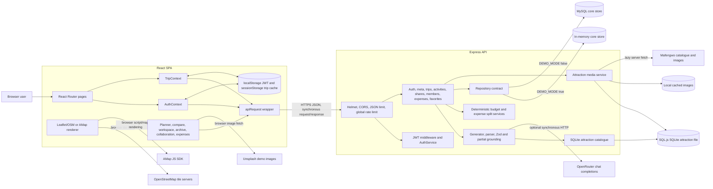

# Nuogo Current Architecture - Verified from Code

Audit date: 2026-08-07  
Baseline: `main` commit `c0155fc`

## Architecture summary

Nuogo is a three-workspace JavaScript monorepo. A React single-page application calls an Express REST API. The API selects one of two core repositories (memory or MySQL) and one of two itinerary providers (deterministic demo or OpenRouter). Attraction catalogue/media always use a separate SQL.js/SQLite repository. Maps are client renderers using Leaflet/OpenStreetMap or AMap; no routing backend exists.

## Actual architecture diagram



## Module boundaries

### Frontend

- `client/src/App.jsx`: route table and global providers.
- `client/src/pages`: landing, login, registration, invitation, planner, comparison, private/shared workspace and archive.
- `client/src/context/AuthContext.jsx`: JWT session bootstrap and user state.
- `client/src/context/TripContext.jsx`: trip/member loading, revision-aware cache and 20-second polling.
- `client/src/api/client.js`: centralized fetch wrapper and 401 token clearing.
- `client/src/components`: itinerary, maps, collaboration, expense and design components.
- `client/src/i18n`: hand-maintained English/Chinese translation object.

There is no formal protected-route component. Private pages render and rely on API/auth state to fail or appear empty.

### Backend

- `server/src/app.js`: composition root and global middleware/error handler.
- `server/src/routes`: handlers contain HTTP concerns plus significant orchestration/business logic; there are no controllers.
- `server/src/services`: authentication, generation, parsing, grounding, budget and domain helpers.
- `server/src/providers`: deterministic demo and OpenRouter plan providers.
- `server/src/repositories`: large memory and MySQL adapters.
- `server/src/ingestion`: bounded Mafengwo catalogue ingestion and SQL.js persistence.
- `shared`: Zod schemas and enumerated constants consumed by server and client imports.

## Connections and failure behavior

| Connection | Initiator/data | Sync model | Failure handling |
|---|---|---|---|
| SPA -> Express | browser sends JSON and bearer JWT | async request/response | `apiRequest` parses error envelope; no client timeout/abort by default |
| Express -> core repository | routes/services read/write aggregates | awaited | errors reach global handler; expected errors carry status/code |
| Express -> OpenRouter | provider sends prompts and model config | awaited | timeout/network/HTTP/JSON errors; initial generation retries then empty fallback |
| Express -> SQLite catalogue | generation reads approved POIs | synchronous SQL.js methods | Huangshan generation returns 422 if no approved records |
| Media service -> Mafengwo image | unauthenticated image request triggers lazy fetch | response redirects immediately; hydration in background | allowlists/limits; background errors swallowed |
| Browser -> OSM | Leaflet loads raster tiles | async browser network | Leaflet shows missing tiles if unavailable |
| Browser -> AMap | component injects SDK script | async | errors swallowed; no fallback after selected provider fails |
| CLI -> Mafengwo HTML | manual ingestion command | awaited | robots/allowlist/content checks; job marked failed |
| CLI/server -> same SQLite file | independent SQL.js copies | no coordination | potential last-writer-wins data loss |

## Actual request flows

### A. Registration

```text
RegisterPage local form
 -> AuthContext.register
 -> apiRequest POST /api/auth/register
 -> authRegistrationSchema (name/email/password)
 -> AuthService checks email
 -> bcrypt hash cost 12
 -> MemoryRepository or MySqlRepository.createUser
 -> seven-day JWT + public user
 -> token in localStorage
 -> navigate to safe return path
```

MySQL unique email protects races; memory mode can race duplicate registration. Errors use the global JSON envelope.

### B. Login

```text
LoginPage
 -> AuthContext.login
 -> POST /api/auth/login
 -> authLoginSchema
 -> repository.findUserByEmail
 -> bcrypt.compare
 -> seven-day JWT
 -> localStorage and user context
```

Startup with a token calls `/api/auth/me`. Logout removes browser state only.

### C. Generate itinerary

```text
PreferenceForm
 -> PlannerPage POST /api/trips/generate
 -> JWT middleware
 -> preferenceSchema + daily budget/conflict flags
 -> SQLite approved catalogue lookup
 -> three concurrent style generators
 -> demo provider OR OpenRouter
 -> JSON extraction + strict Zod
 -> partial Huangshan grounding
 -> empty fallback on repeated failure
 -> repository.createTrip
 -> comparison page
```

MySQL creation is transactional. Initial OpenRouter budget arithmetic and factual data are not semantically verified.

### D. Budget calculation

Initial demo plans are recalculated from activities; initial OpenRouter plans retain model budget JSON. Workspace mutations call deterministic `calculateBudget`. It groups activity estimated costs into four categories, but transportation reads a nonexistent field and remains zero. Client `deriveBudget` sums the stored category object. There is no traveler count/per-person result.

### E. Regeneration

Activity/day endpoints load context, authorize editor, capture expected revision, call the provider for an entire variant, then use only the first generated activity or first generated day. The repository rechecks role/revision and writes an activity log. No full-plan/category-allocation regeneration exists.

### F. Save, edit and delete

Generation immediately persists; there is no separate save button. Trip/activity edits use PATCH plus optimistic revision. Reorder requires every activity exactly once. Trip delete is owner-only; activity delete is editor-capable. Archive lists persisted trips, but its cards do not provide a normal reopen action.

### G. Tour guide recommendation

No such subsystem exists. `activity.guide` contains four bilingual narrative tips (culture, food, crowd, visit), and `GuidePanel` displays them under “local guide.” There are no guide profiles, languages, prices, ratings, contacts, comparison, table or API.

### H. Administration

No admin role, page, route, middleware or table exists. Attraction review is a local command-line operation against SQLite and is authorized only by filesystem/process access.

## Architectural strengths

- Clear server-only AI provider boundary.
- Shared strict Zod contracts.
- Repository abstraction supports demo/live modes.
- Strong collaborative object authorization and revision handling.
- Transactional MySQL writes for trip creation/collaboration/expenses.
- Exact integer-fen shared expenses.
- Defensive media retrieval.
- Centralized client API wrapper and revision-aware trip polling.

## Architectural weaknesses

- Routes contain orchestration and domain policy; repositories are 772/1,277-line monoliths.
- Memory and MySQL behavior diverges after delete/duplicate/favorite operations.
- Travel catalogue uses an unsafe second database architecture.
- LLM remains a factual source for most cities.
- Maps are not routing services.
- Budget, traveler, price, route and verification domains are under-modeled.
- UI contains simulated pipeline progress and incomplete archive reuse/open workflows.
- No admin domain, migration runner, structured logging, CI, linting or typecheck.

## Current architecture verdict

The application is a usable prototype with a good collaboration core. It is not a defensible final travel-planning architecture because verified data, deterministic route/budget validation, and operational database boundaries are missing or misleading.
