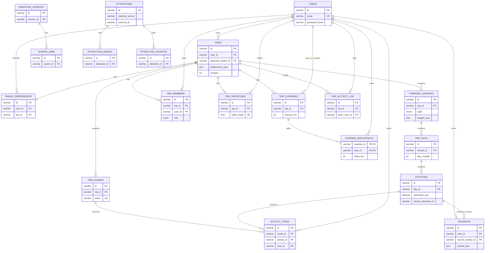

# Nuogo Current Database Audit

Audit date: 2026-08-07

## Actual persistence topology

Nuogo does not use one database:

1. `MemoryRepository` is the default core store when `DEMO_MODE` is not explicitly false. It is process-local and disappears on restart.
2. `MySqlRepository` is the intended live core store for users, trips, activities, sharing, collaboration and expenses.
3. `AttractionSqliteRepository` is always created for attraction ingestion/catalogue/media, even when core persistence is MySQL.
4. Migration `002_anhui_ingestion.sql` also creates attraction/ingestion tables in MySQL, but runtime code never uses those tables.

The local ignored SQLite file existed during audit. It contained 1 source, 2 scrape jobs, 34 attractions, 34 image records and 34 source records; 8 attractions were approved/active and 26 pending/active. Eight cached media files totaled 286,902 bytes.

## MySQL table inventory

| Table | Purpose | Important columns | Relationships | Used? | Problems |
|---|---|---|---|---|---|
| `users` | accounts | id, email, password_hash | owns trips and user-linked records | Yes | no role/status/session fields |
| `trips` | trip aggregate root | user_id, selected_variant_id, preferences_json, revision | user, variants, members, shares, expenses | Yes | duplicates normalized preferences; selected variant can reference another trip's variant |
| `travel_preferences` | normalized preference record | destination, days, budget, JSON interests/conflicts | user + one trip | Write-only | later reads use `trips.preferences_json`; redundant |
| `itinerary_variants` | three alternatives | style, bilingual JSON, budget_json, is_fallback | many per trip | Yes | AI metadata/provenance absent; budget is JSON and may be unreconciled |
| `trip_days` | day sequence | variant_id, day_number, date, title_json | variant -> activities | Yes | no rule proving consecutive dates or requested day count |
| `activities` | scheduled stops | times, bilingual JSON, coordinates, estimated_cost, guide_json | day, votes, favorites | Yes | no route duration/distance/currency/price source; source attraction has no FK/index; routeCluster not persisted |
| `trip_shares` | public bearer links | token, permission | trip -> votes | Yes | plaintext, no expiry/revoke/audit; `edit` naming is misleading |
| `activity_votes` | one vote per actor/share/activity | share_id, activity_id, user_id | share, activity, user | Yes | DB cannot ensure activity belongs to shared trip |
| `favorites` | saved activity snapshot | source_activity_id, activity_json | user + activity | Yes | duplicate/stale JSON; creation lacks trip authorization |
| `ingestion_sources` | source registry | provider, URL, fetch metadata | scrape jobs | No runtime consumer | duplicates SQLite schema |
| `scrape_jobs` | ingestion history | status/count/error | source | No runtime consumer | duplicates SQLite schema |
| `attractions` | POI facts/review | source IDs, facts, review_status | images/sources only | No runtime consumer in MySQL | no source FK, reviewer or verification timestamp |
| `attraction_images` | image provenance/cache | URL, attribution, local_path | attraction | No runtime consumer in MySQL | duplicate SQLite schema |
| `attraction_sources` | source snapshots | URLs, retrieved_at, facts_json | attraction | No runtime consumer in MySQL | content hash/facts provenance incomplete |
| `trip_members` | owner/editor/viewer membership | role, status, timestamps | trip + user | Yes | owner also duplicated in `trips.user_id`; DB does not enforce exactly one owner |
| `trip_invitations` | expiring invitation | token_hash, role, status, expiry | trip, inviter, acceptor | Yes | sound baseline; no recipient email binding by design |
| `trip_expenses` | shared spend | amount_fen, date, payer, creator | trip + users + participants | Yes | no currency field; assumes CNY |
| `expense_participants` | exact split | expense_id, user_id, share_fen | expense + user | Yes | exact-sum rule enforced in app, not DB constraint |
| `trip_activity_log` | collaboration audit | actor, action, entity, summary_json | trip + user | Yes | action/entity are free strings; no immutable policy |

## SQLite tables

`server/src/ingestion/sqliteRepository.js` recreates five analogous tables: `ingestion_sources`, `scrape_jobs`, `attractions`, `attraction_images`, and `attraction_sources`. They are the actual runtime catalogue. The repository loads the entire database file into SQL.js and exports the full database after each mutation.

This design is unsafe when the server and ingestion/review CLI run concurrently: independent in-memory copies can overwrite each other's updates.

## Actual ERD

## Referential and normalization findings

### Missing/weak relations

- `activities.source_attraction_id` has no FK or index.
- `attractions` stores `external_source` text but is not linked to `ingestion_sources`.
- `trips.selected_variant_id` does not enforce that the selected variant belongs to the same trip.
- `activity_votes` does not enforce that the voted activity belongs to the shared trip.
- `trip_members` does not enforce one active owner or alignment with `trips.user_id`.
- No verified entities exist for hotels, restaurants, agencies/guides, ticket products, price observations or route legs.

### Duplicate/denormalized data

- `trips.preferences_json` duplicates `travel_preferences`; the latter is write-only.
- `favorites.activity_json` intentionally snapshots an activity but can become stale.
- bilingual content in JSON is defensible for display aggregates, but important queryable facts and budgets are hidden in JSON.
- vote count is stored on activities as well as represented by vote rows, creating reconciliation risk.

### Missing operational data

- No migration history/version table or runner.
- No LLM generation run, model, prompt version, validator result or fallback reason table.
- No field-level source provenance, verification status/timestamp, reviewer identity or freshness policy.
- No currency or price-valid-at timestamp.
- No route distance, duration, mode, provider or coordinate reference system.
- No traveler count.
- No admin role or audit of attraction review CLI actions.

## Migration and seed status

- Five manually applied migration files exist.
- `001` uses `CREATE TABLE IF NOT EXISTS` but later adds a foreign key unconditionally.
- `003`, `004` and `005` use unguarded `ALTER TABLE ADD COLUMN`; replay is not safe.
- No package script applies migrations.
- No live MySQL migration/seed test was run because no MySQL service/client is configured.
- Schema tests inspect SQL text; repository tests mock connections.
- The demo seed creates an openable trip/variant/day/activity and group expenses, but also contains a predictable demo login. It is not production-safe.

## Keep / refactor / replace / delete

| Area | Decision | Reason |
|---|---|---|
| Core relational trip/day/activity shape | KEEP WITH CHANGES | sensible aggregate baseline |
| Membership/invitation/expense tables | KEEP | strong and normalized |
| Integer-fen expense storage | KEEP | exact arithmetic |
| `travel_preferences` plus `preferences_json` duplication | REFACTOR/DELETE one representation | current table is write-only |
| `favorites.activity_json` | REFACTOR | define snapshot semantics/version |
| Manual migrations | REPLACE | no history, replay or automated deployment |
| Duplicate MySQL/SQLite ingestion schemas | REPLACE | one authoritative data architecture is required |
| SQL.js whole-file writes | REPLACE | cross-process data-integrity risk |
| Current attraction approval model | REPLACE | provenance/re-review/auditor missing |
| Existing seeded demo data | KEEP only in explicit demo environment | predictable credentials and fake data |

## Database verdict

The collaboration/expense relational model is a good foundation. The travel-data and deployment model is not. The final architecture should use one authoritative, transactional catalogue/data store with explicit source/version/verification records and real migration tooling.
