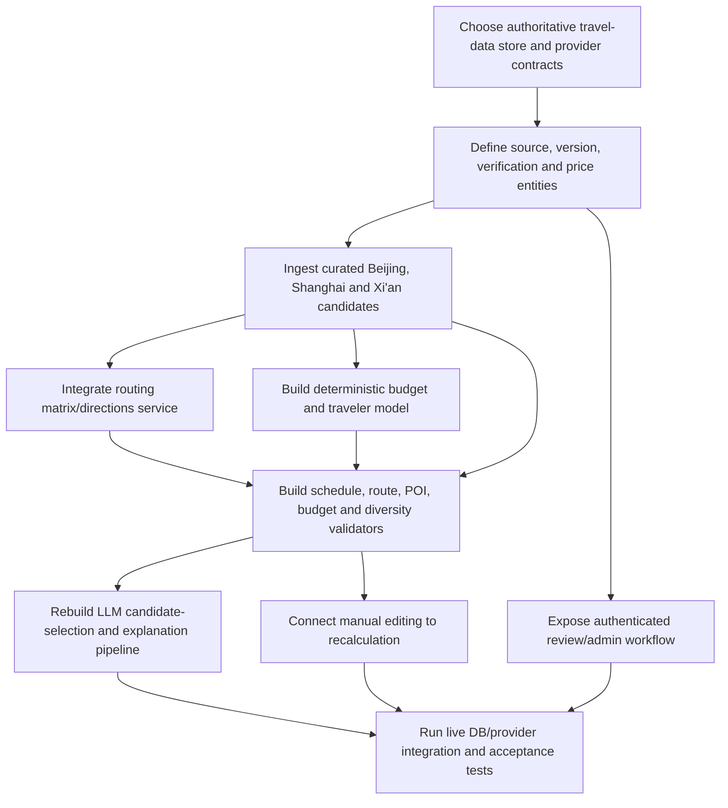

# Nuogo Migration Readiness Assessment

Audit date: 2026-08-07  
Target scope: Beijing, Shanghai and Xi'an first; verified-data and deterministic-validation architecture

## Overall assessment

Migration difficulty: **High, but lower than a full rewrite**.

The application shell, REST boundary, shared schemas, collaboration and expense features can remain. The current travel intelligence cannot be incrementally relabeled as verified: candidate data, prices, routes, budget semantics, AI grounding and administration require new domain models and services. The safest migration keeps the user-facing product running while replacing those cores behind explicit interfaces.

This document is an assessment, not an implementation plan.

## Target/current comparison

| Target responsibility | Current state | Gap | Difficulty |
|---|---|---|---|
| Verified POI candidates for Beijing/Shanghai/Xi'an | three hard-coded demo POIs per city or model output | complete candidate/source pipeline missing | High |
| Verified prices and coordinates | no reliable price observations; model/demo values | new entities, providers, freshness and review needed | High |
| Verified agencies | no agency domain | entire domain missing | High |
| Deterministic budget | four-category partial sum; transport broken; no travelers | replace model/calculator/storage | High |
| Schedule validation | format checks only | overlaps, hours, duration and day boundaries missing | High |
| Route validation/optimization | straight polylines | routing provider, CRS, travel modes and matrix needed | High |
| LLM selects approved candidates | only partial optional Huangshan IDs | enforce candidate IDs and reject free-form entities | Medium-high |
| JSON Schema + semantic validation | Zod after JSON-object response | actual schema, validator stages and error taxonomy needed | Medium |
| Repair loop | blind retries | validator feedback and bounded repair missing | Medium-high |
| Diversity validation | three style labels only | similarity/constraint targets missing | Medium |
| Budget-Safe/Balanced/Premium semantics | budget/food/leisure | product and schema migration required | Medium |
| Manual candidate editing + recalculation | CRUD/reorder exists | candidate picker and deterministic recomputation missing | Medium-high |
| Authenticated admin review | local CLI | role, UI, API, audit and workflow missing | High |

## What can stay

### Keep

- React/Express/npm-workspace shape.
- Central client `apiRequest` concept.
- Server-only provider calls.
- Shared Zod contract package.
- Trip/variant/day/activity aggregate concept.
- Owner/editor/viewer collaboration.
- Optimistic revisions and activity log.
- Invitation and group-expense design.
- MySQL as the intended authoritative database.
- Leaflet/AMap rendering components as display layers.
- Safe media retrieval controls.
- Existing test style and fixtures as regression coverage.

### Keep with small changes

- Authentication UI and bcrypt handling, after session/default hardening.
- Preference form, after adding traveler count, mobility/pace and explicit constraints.
- Comparison UI, after changing alternative semantics and showing transparent budget deltas.
- Timeline editing/reordering, after recalculation and feasibility results become mandatory.
- Archive, after adding open/reuse behavior and honest loading/error states.

## What must change

### Refactor

- Split route orchestration from domain services without introducing microservices.
- Break repositories into focused modules behind the same application boundary.
- Replace ad hoc AI retries with explicit generation/validation results.
- Make every activity reference approved candidate/version records.
- Add honest progress/failure states.
- Add public share expiry, revocation and public DTOs.
- Add protected frontend routes and accessibility fixes.
- Add real migration automation and integration tests.

### Replace/rebuild

- SQL.js whole-file attraction persistence and duplicate MySQL ingestion tables.
- Attraction approval/provenance model.
- Budget categories/calculation/storage.
- Routing/nearby grouping/route optimization.
- OpenRouter prompt, output contract, semantic validators and repair loop.
- Demo/model-derived live hotels, restaurants, tickets and coordinates.
- Admin CLI as the only review mechanism.
- Tour-guide recommendation if the project adopts verified travel agencies instead.

### Delete from final live path

- `demoCatalog.js` as factual input.
- synthetic hotel/food/stay identities and unrelated Unsplash entity images.
- 55% cheaper-alternative rule.
- fake child/student ticket calculation.
- `DemoRouteMap.jsx`.
- simulated pipeline stage timing.
- optional source IDs for purportedly verified activities.
- unused MySQL ingestion tables or the duplicate SQLite schema, depending on selected authoritative store.

## Major migration dependencies



This is a dependency map, not a schedule. Candidate/source modeling blocks credible AI, budget and route work. Implementing the LLM first would reproduce the current architectural defect.

## Target AI pipeline readiness

| Planned stage | Reusable current part | Required replacement |
|---|---|---|
| Input validation | Zod preferences and conflict concept | traveler count and richer constraints |
| Candidate retrieval | SQLite catalogue interface concept | verified three-city repository/provider adapters |
| Prompt/constraint builder | separated system/user messages | actual schema, candidate IDs and prompt versions |
| Structured JSON | parser + Zod | provider JSON Schema and bounded candidate-only output |
| Semantic validation | destination equality/coordinate bounds | all domain validators |
| POI verification | partial Huangshan ID/name check | mandatory candidate/version references |
| Schedule validation | none | rebuild |
| Route validation | none | rebuild with routing service |
| Budget validation | partial calculator | rebuild with price observations/travelers |
| Diversity validation | style labels | rebuild |
| Repair loop | blind retries | rebuild with validator feedback |
| Final persistence | transactional trip creation | add generation/source/validation audit records |

## Alternative semantics migration

Current `budget`, `food`, and `leisure` are product themes, not the proposed financial risk tiers. The schema, prompts, demo fixtures, database enum, comparison copy and tests all encode those values. Moving to:

- Budget-Safe: hard budget constraint;
- Balanced/Comfort: transparent allowance around +10%;
- Premium Experience: soft budget/reference constraint;

requires a coordinated contract/data migration. It is manageable because styles are centralized in shared constants and generation logic, but existing stored trips need explicit legacy handling.

## Manual editing readiness

Current CRUD, reorder and optimistic revisions are valuable. What is missing is the invariant chain after every edit:

```text
candidate selection
 -> candidate/version verification
 -> route recalculation
 -> schedule validation
 -> deterministic budget recalculation
 -> persist only valid result or show explicit conflicts
```

Today, editing accepts free-form activity facts, reordering changes no travel timing, and client/server budget calculations can diverge. Therefore the UI interaction can stay, but its domain effects must be rebuilt.

## Travel agency replacement readiness

No tour-guide records or contracts need migration because none exist. The misleading `activity.guide` field contains tips and should be renamed to something like visit guidance if retained. A verified agency feature would be a new bounded context requiring:

- agency identity and service-area records;
- license/public-source provenance and verification date;
- languages/specializations/contact channels;
- price/quote semantics and disclaimers;
- admin review and comparison UI.

Difficulty is high due to data acquisition and verification, not because of legacy code.

## Risk by migration area

| Area | Risk | Why |
|---|---|---|
| Data provider access/licensing | Very high | official/partner availability and usage rights are external constraints |
| Route provider/CRS | High | China coordinate systems, quotas and mode coverage |
| Price truth/freshness | Very high | ticket/hotel/transport prices vary and may require partner access |
| Database migration | Medium-high | existing JSON and dual stores need controlled transition |
| AI pipeline | Medium-high | boundary exists, internals must change |
| UI migration | Medium | current comparison/workspace patterns are reusable |
| Collaboration regression | Low-medium | subsystem is isolated and well tested |
| FYP scope | High | three cities still require disciplined source limits |

## Architectural difficulty estimate

| Subsystem | Estimate | Assessment |
|---|---|---|
| Preserve UI/auth/collaboration/expenses | Low-medium | mostly refinement |
| Unified verified data model/admin | High | new core domain |
| Three-city source ingestion | High/externally dependent | APIs/licensing can dominate |
| Deterministic budget | High | data quality plus new model |
| Routing/feasibility | High | new provider and validators |
| Safe LLM composition/repair | Medium-high | provider boundary helps |
| Data migration/testing/operations | High | live infrastructure currently absent |
| Overall | High | major core rebuild, not full application rewrite |

## Readiness verdict

Nuogo is ready to migrate only at the application-shell level. It is not ready to claim reliable travel intelligence. The migration should preserve tested collaboration and interaction surfaces while making verified candidates, deterministic constraints and routing authoritative. The LLM must become a composer/explainer operating on approved IDs, never the database of facts.
