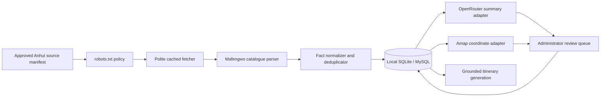

# Nuogo Anhui Attraction Ingestion Design

## Goal

Create a bounded ingestion engine that collects factual attraction metadata from approved public Mafengwo catalogue pages, stores it in Nuogo's own local database with attribution, and exposes only administrator-approved records to itinerary generation.

## Scope

### Included

- Anhui Province only.
- Mafengwo mobile destination and guide catalogue pages under approved URLs.
- Attraction names, optional English names, Mafengwo POI IDs, source URLs, image source URLs, location labels, review counts, travel-note mention counts, and image counts.
- Page-level factual context such as ticket-price references and opening-time text.
- Original bilingual Nuogo summaries generated from extracted facts.
- Local SQLite persistence for immediate development.
- Equivalent MySQL migration for deployment.
- Pending, approved, and rejected review states.
- Cached source responses and polite sequential requests.

### Excluded

- Authentication, CAPTCHA, paywall, or access-control bypass.
- Paths disallowed by the active `robots.txt`.
- User travel diaries and user review bodies.
- Republishing source descriptions verbatim.
- Downloading full-resolution third-party image libraries.
- Crawling outside the approved Anhui source manifest.

## Geographic Rollout

1. `huangshan`: Huangshan Scenic Area, Tunxi, Hongcun, Xidi, Shexian, Chengkan, Qiyun Mountain, Emerald Valley, and Taiping Lake.
2. `hefei`: Hefei urban and nearby attractions.
3. `chizhou`: Chizhou and Jiuhua Mountain.
4. `xuancheng`: Xuancheng and surrounding cultural/natural attractions.
5. `anqing`: Anqing and Tianzhu Mountain.
6. `wuhu`: Wuhu urban and riverside attractions.

Phase 1 ships with an approved Huangshan catalogue seed. Later regions use the same importer and require an administrator-approved seed URL before crawling.

## Pipeline



## Source Rules

- Allowed hosts: `m.mafengwo.cn` and explicit image hosts ending in `.mafengwo.net`.
- Allowed content path for Phase 1: `/gl/catalog/index`.
- The importer fetches and evaluates `/robots.txt` before a source page.
- The importer sends a descriptive Nuogo FYP user agent.
- Requests are sequential with a default delay of 2.5 seconds.
- A source is fetched at most once within its cache TTL unless `--refresh` is supplied.
- Redirects are accepted only when the final host remains allowlisted.
- Every imported record stores source provider, URL, POI ID, retrieval time, and a content fingerprint.

## Extraction Contract

Each `a.spot.poi` card produces:

```text
externalId
nameZh
nameEn
locationLabel
thumbnailUrl
reviewCount
travelNoteCount
imageCount
sourceUrl
sourcePageUrl
regionId
province
```

The parser reads only card-level fields. It does not store full guide paragraphs. Page-level ticket and opening text may be retained as short factual source notes for administrator verification, not published directly.

## Persistence

### `ingestion_sources`

- `id`
- `provider`
- `region_id`
- `source_url`
- `source_type`
- `enabled`
- `last_fetched_at`
- `last_status`
- `etag`
- `content_hash`
- timestamps

### `scrape_jobs`

- `id`
- `source_id`
- `status`
- `started_at`
- `completed_at`
- `items_found`
- `items_created`
- `items_updated`
- `error_message`

### `attractions`

- `id`
- `province`
- `region_id`
- `external_source`
- `external_id`
- `name_zh`
- `name_en`
- `description_zh`
- `description_en`
- `location_label`
- `address`
- `longitude`
- `latitude`
- `ticket_price_min`
- `ticket_price_max`
- `opening_hours`
- `category`
- `review_count`
- `travel_note_count`
- `image_count`
- `review_status`
- `active`
- timestamps
- unique provider/external-ID constraint

### `attraction_images`

- `id`
- `attraction_id`
- `source_url`
- `source_provider`
- `attribution`
- `is_primary`
- `local_path`, nullable and used only for licensed downloads
- timestamps

### `attraction_sources`

- `id`
- `attraction_id`
- `source_url`
- `source_page_url`
- `retrieved_at`
- `content_hash`
- `facts_json`
- timestamps

The local development database is `database/local/nuogo-attractions.sqlite` and is excluded from source control. MySQL uses the same logical entities through `database/migrations/002_anhui_ingestion.sql`.

## Interfaces

### CLI

```powershell
npm run ingest:anhui -- --region huangshan
npm run ingest:anhui -- --region huangshan --refresh
npm run attractions:list -- --status pending
```

### Services

```text
validateSourceUrl(url)
loadRobotsPolicy(origin, fetchImpl)
isPathAllowed(policy, userAgent, pathname)
fetchSourcePage(source, options)
parseMafengwoCatalog(html, context)
normalizeAttraction(raw)
upsertAttractions(records)
runIngestion(regionId, options)
```

### Future Administration API

- `GET /api/admin/ingestion/sources`
- `POST /api/admin/ingestion/jobs`
- `GET /api/admin/attractions?status=pending`
- `PATCH /api/admin/attractions/:id/review`

The CLI is implemented first. The administration UI consumes the same repository methods in the administration phase.

## OpenRouter and Amap Enrichment

OpenRouter receives extracted factual fields and returns original bilingual summaries in a strict JSON contract. Source paragraphs are not inserted as publishable output. Failed enrichment leaves descriptions empty and the record pending.

Amap geocoding uses the attraction name, location label, and Anhui city. Coordinates must fall inside a configured Anhui bounding box before approval. Missing Amap credentials do not block ingestion; coordinates remain null and require review.

## Itinerary Grounding

The itinerary generator will query only:

```text
province = Anhui
review_status = approved
active = true
coordinates verified when a route map is required
```

OpenRouter receives a bounded attraction list with stable local IDs. Generated activities must reference one of those IDs. Unknown model-generated attractions fail validation.

## Error Handling

- Unsupported host: `SOURCE_HOST_NOT_ALLOWED`.
- Disallowed path: `SOURCE_PATH_NOT_ALLOWED`.
- Robots rejection: `ROBOTS_DISALLOWED`.
- Redirect outside allowlist: `SOURCE_REDIRECT_NOT_ALLOWED`.
- Non-HTML response: `SOURCE_CONTENT_TYPE_INVALID`.
- Parse result with no POIs: `SOURCE_PARSE_EMPTY`.
- Network failure: job marked `failed`; prior approved data remains unchanged.
- Duplicate source card: merged by provider and external ID.

## Testing

- URL allowlist rejects non-Mafengwo and disallowed paths.
- Robots parser permits the Phase 1 path and rejects matching disallow rules.
- HTML fixture extracts Chinese/English names, counts, image URL, POI ID, and location.
- Parser never stores full article paragraphs.
- Normalizer rejects records without ID or Chinese name.
- SQLite repository inserts and idempotently updates attractions.
- Ingestion records successful and failed job metrics.
- MySQL migration defines all five ingestion tables and required unique constraints.
- Network integration test is opt-in and never part of the default test suite.

## Acceptance

- Running the Huangshan CLI creates a real local SQLite database.
- Re-running without refresh uses the cache and does not duplicate attractions.
- All records include Mafengwo source attribution.
- Imported records are pending, not immediately available to itinerary generation.
- No user diary body or review body is stored.
- Expansion regions are represented in the manifest and cannot run without an approved source URL.
