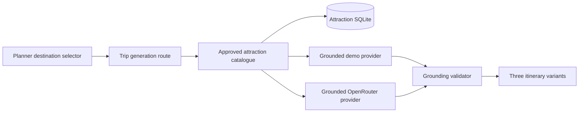

# Nuogo Anhui Grounded Itinerary Design

## Goal

Connect Nuogo's local Huangshan attraction catalogue to the existing three-option itinerary workflow so the frontend can generate and compare a testable Anhui trip without requiring MySQL.

## Scope

This increment adds:

- Huangshan, Anhui as a bilingual planner destination.
- An explicit CLI review command for approving or rejecting imported attractions.
- A read-only catalogue service that loads active, approved Huangshan attractions from SQLite.
- Grounded Huangshan generation in the deterministic demo provider.
- The same bounded attraction context in OpenRouter prompts when live AI is enabled later.
- Post-generation validation that rejects Huangshan activities not grounded in the approved catalogue.
- Source attribution and source URLs on grounded activity details.
- Tests for review state, catalogue loading, prompt grounding, output validation, and the HTTP generation workflow.

This increment does not add:

- A browser-based administration panel.
- Automatic approval of newly scraped records.
- MySQL as a requirement for local testing.
- Amap geocoding or route optimization.
- New Anhui regions beyond Huangshan.

## Runtime Architecture

The user and trip repository remains the existing in-memory repository for local development. Attraction ingestion and review use `database/local/nuogo-attractions.sqlite`.



Generation mode and persistence mode are independent. Local testing can therefore use the in-memory trip repository with either the grounded demo provider or OpenRouter. Demo generation remains the default so the project is demonstrable when a free AI model is unavailable.

## Review Workflow

The repository adds a method that changes review status only for active records in a requested region. The CLI requires an explicit region, target status, and record selection. For the first local test, the highest-reviewed Huangshan records can be listed and then approved by ID.

```powershell
npm run attractions:list -- --status pending --region huangshan --limit 12
npm run attractions:review -- --region huangshan --status approved --ids <comma-separated-ids>
```

No ingestion command approves records automatically. Re-importing an attraction preserves its existing review decision.

## Catalogue Contract

The itinerary catalogue exposes only:

```text
province = Anhui
region_id = huangshan
review_status = approved
active = true
```

Each catalogue item contains:

- Stable local attraction ID.
- Chinese and optional English name.
- Original Nuogo descriptions when available.
- Location label and address when available.
- Category and ticket estimate when available.
- Coordinates when available.
- Primary image URL and Mafengwo source URL.
- Source provider attribution.

Missing optional facts stay missing. They are not presented as scraped facts.

## Grounded Generation

For Huangshan requests, the generation service loads the approved catalogue before starting the three parallel styles. An empty catalogue produces `ATTRACTION_CATALOGUE_EMPTY` with a clear review instruction.

The deterministic provider builds each itinerary from approved catalogue records. It assigns safe prototype defaults for scheduling and costs where factual values are absent, clearly treating those values as estimates. It uses stable attraction IDs as `sourceAttractionId` while keeping each activity's own unique ID.

OpenRouter receives a compact JSON attraction catalogue in the user message. Its locked system instruction requires every activity to include a `sourceAttractionId` from that list and forbids additional attractions. This catalogue is server-provided context, not user prompt text.

## Validation

`sourceAttractionId` is optional for existing non-Anhui destinations and required for Huangshan activities. After parsing each generated Huangshan variant, the grounding validator checks:

- Every activity has a source attraction ID.
- Every source attraction ID exists in the catalogue supplied for that request.
- The activity's Chinese name matches the corresponding approved record.
- The output destination remains `huangshan`.

An invalid live AI response uses the existing retry behavior. If all retries fail, the style becomes an editable fallback and records the generation error.

## User Interface

The existing destination selector gains:

- `Huangshan, Anhui` in English.
- `安徽黄山` in Simplified Chinese.

Grounded activities display a small source row in the activity detail view with the provider name and an external source link. The row is absent for ungrounded legacy demo activities.

No new landing page or explanatory panel is added.

## Configuration

Repository mode and plan-provider mode become separate:

```dotenv
DEMO_MODE=true
AI_PROVIDER=demo
ATTRACTION_SQLITE_PATH=
OPENROUTER_API_KEY=
OPENROUTER_MODEL=
```

- `DEMO_MODE=true` keeps in-memory app persistence.
- `AI_PROVIDER=demo` uses deterministic grounded generation.
- `AI_PROVIDER=openrouter` uses OpenRouter and requires its API key.
- MySQL credentials are required only when `DEMO_MODE=false`.

The committed environment example contains placeholders only. Any exposed key in `.env.example` is removed and must be rotated before live use.

## Error Handling

- No approved Huangshan records: HTTP 422, `ATTRACTION_CATALOGUE_EMPTY`.
- Unknown review region or attraction ID: CLI exits non-zero without partial changes.
- Invalid review status: CLI exits non-zero.
- SQLite unavailable: generation returns a server error with the database path omitted from the client message.
- Unknown model-generated attraction: retry, then style fallback if retries are exhausted.
- OpenRouter unavailable: existing provider failure and fallback behavior applies independently to each style.

## Testing

Automated tests cover:

- Huangshan is accepted by shared preference and itinerary schemas.
- Existing unsupported destinations remain rejected.
- Repository lists by region and updates selected review states atomically.
- Catalogue returns only active approved Huangshan records.
- Grounded demo generation uses catalogue names and IDs.
- Prompt builder includes only the bounded catalogue for Huangshan.
- Grounding validator rejects missing and unknown source IDs.
- API creates three Huangshan variants using approved records.
- API reports an empty-catalogue error before generation.
- Planner selector displays Huangshan in English and Chinese.

## Acceptance Test

1. List the pending Huangshan records.
2. Explicitly approve a curated set of at least eight records.
3. Start Nuogo in local demo persistence with grounded demo generation.
4. Register or sign in through the frontend.
5. Select `Huangshan, Anhui`.
6. Generate a four-day student-group trip.
7. Confirm three selectable variants are returned.
8. Confirm every non-fallback activity references an approved local attraction.
9. Open an activity and confirm its Mafengwo attribution link is visible.
10. Confirm the API health endpoint reports the active provider mode.
