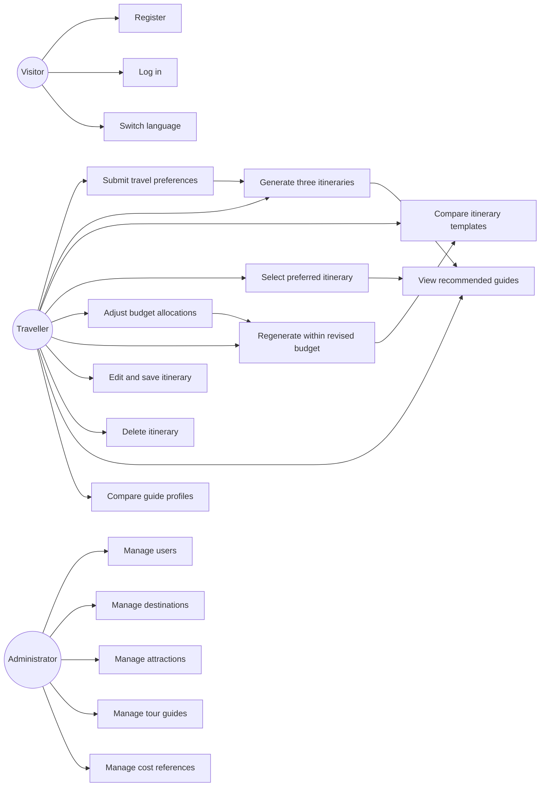
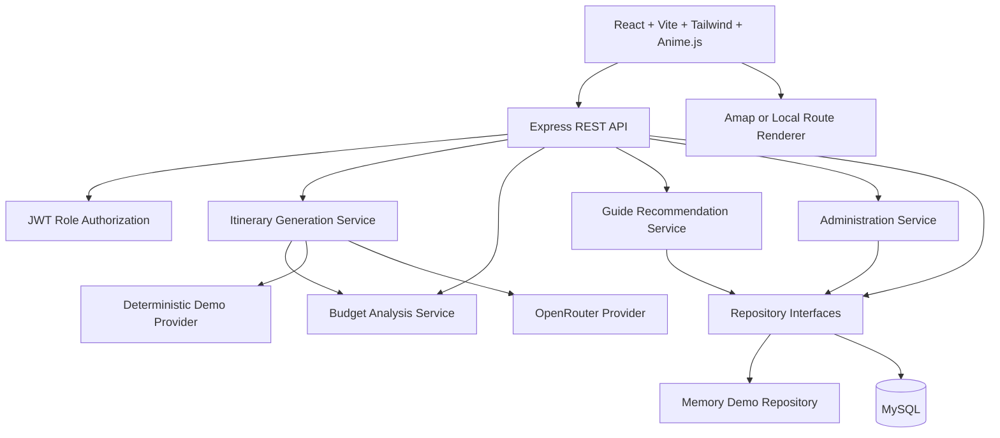
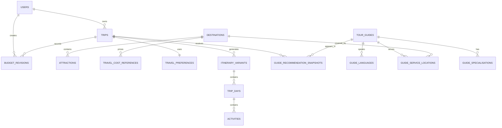

# Nuogo: An AI-Powered Smart Travel Planner

## 1. Document Purpose

This document is the canonical requirements and system design for the Nuogo final-year project. It supersedes earlier scope decisions that excluded administration, used only four budget categories, or treated destination advice as a substitute for tour-guide recommendations.

Nuogo is a bilingual, full-stack travel planning prototype for domestic travel in mainland China. The implemented destination-data pilot is bounded to Anhui Province while its contracts remain extensible to other provinces. It must demonstrate all three academic objectives as connected, testable modules:

1. Multiple AI-generated itinerary options.
2. Intelligent budget planning and cost breakdown.
3. Tour-guide recommendation.

The budget module and tour-guide module are separate objectives. Neither may replace the other.

## 2. Problem Statement

Travellers commonly need to combine fragmented destination research, itinerary planning, expense estimation, and guide discovery. Existing planning tools may return a single generic route, provide a disconnected manual budget calculator, or list tour guides without considering the traveller's itinerary and preferences.

Nuogo addresses this problem through one structured workflow. It generates at least three explainable itinerary alternatives, calculates group and per-person costs across six categories, supports category-level budget adjustment and AI regeneration, and recommends suitable tour guides using the same destination, language, budget, interests, and preference context.

Administrators maintain the reference data that makes these recommendations reliable: destinations, attractions, guides, and travel cost references.

## 3. Project Objectives

### Objective 1: Multiple AI-Generated Itinerary Options

Develop an AI itinerary generator that produces at least three personalised alternatives using:

- destination;
- travel start and end dates;
- travel duration;
- total budget;
- number of travellers;
- travel interests;
- accommodation, pace, accessibility, and other structured preferences.

The system shall:

- generate budget-friendly, balanced, and comfort-focused options concurrently;
- present each option as a separate selectable template;
- explain differences in pace, accommodation, transport, attractions, experiences, and cost;
- provide side-by-side comparison;
- allow selection and persistence of one preferred option;
- allow regeneration of all options when preferences change or the user is dissatisfied.

### Objective 2: Intelligent Budget Planning and Cost Breakdown

Develop an itinerary-connected budget engine that estimates:

- accommodation;
- transportation;
- food and beverages;
- attraction tickets;
- entertainment and activities;
- other estimated expenses.

The system shall:

- display category values and total estimated cost;
- display remaining or exceeded budget;
- calculate average cost per person;
- support group travel calculations using traveller count;
- display a chart and numeric breakdown;
- expose allocation controls for accommodation, transport, food, attractions, entertainment, and other costs;
- validate that allocations equal 100 percent;
- regenerate all itinerary options after allocation changes;
- pass the updated total budget and allocations into the AI generation contract;
- verify regenerated options against the updated limits.

This module is not a standalone manual calculator. It consumes generated itinerary activities and controls subsequent AI regeneration.

### Objective 3: Tour Guide Recommendation

Develop a tour-guide recommendation engine using:

- destination;
- preferred language;
- total and guide budget;
- travel interests;
- travel preferences;
- guide specialisation;
- itinerary dates and availability.

The system shall allow users to:

- view ranked guide recommendations;
- open complete guide profiles;
- view languages spoken;
- view service locations;
- view years of experience and specialisations;
- view estimated daily pricing;
- view ratings and review count;
- view contact information while authenticated;
- select guides for comparison;
- compare suitable guides on common criteria.

Destination cultural advice attached to an activity remains a supporting feature. It is not the tour-guide recommendation module.

## 4. Actors and Roles

### Visitor

- View the landing page.
- Switch interface language.
- Register and log in.

### Traveller

- Manage their profile.
- Submit travel preferences.
- Generate, compare, select, edit, save, regenerate, and delete itineraries.
- Adjust budget allocations and regenerate options.
- View and compare recommended tour guides.
- Share trips, vote, save favourites, and use the archive.

### Administrator

- Log in through the same authentication system with an `admin` role.
- View management summaries.
- List, search, activate, or deactivate users.
- Create, edit, and archive destinations.
- Create, edit, and archive tourist attractions.
- Create, edit, and archive tour guides.
- Maintain guide languages, locations, specialisations, pricing, ratings, availability, and contact information.
- Maintain category-level travel cost reference data.

## 5. System Scope

### Included

- Bilingual English/Chinese interface with English as default.
- JWT authentication with traveller and administrator roles.
- Structured mainland-China travel questionnaire.
- Three or more parallel AI itinerary alternatives.
- Option explanation, comparison, selection, and regeneration.
- Traveller-aware group and per-person costing.
- Six-category budget breakdown and chart.
- Budget allocation controls and AI regeneration.
- Tour-guide ranking, profile, contact, and comparison.
- Itinerary CRUD, reordering, partial regeneration, maps, sharing, voting, favourites, and archive.
- Administration dashboard and reference-data CRUD.
- MySQL live persistence and credential-free memory/demo adapters.
- OpenRouter live AI adapter and deterministic demo generator.
- Amap live map adapter and local route fallback.
- Anime.js motion with reduced-motion support.
- A bounded Anhui attraction-ingestion pipeline using approved public catalogue pages, source attribution, local persistence, and administrator review.

### Excluded

- International destinations.
- Open-ended AI chat.
- Booking, payments, guide contracting, and messaging.
- Unbounded crawling, authenticated pages, user travel diaries, copied third-party descriptions, and unlicensed bulk image downloads.
- Notifications.
- Automatic publication of guide reviews.

### Anhui Data Rollout

The ingestion catalogue expands in controlled phases:

1. Southern Anhui: Huangshan Scenic Area, Huangshan city, Tunxi, Hongcun, Xidi, Shexian, Chengkan, Qiyun Mountain, Emerald Valley, and Taiping Lake.
2. Hefei.
3. Chizhou and Jiuhua Mountain.
4. Xuancheng.
5. Anqing and Tianzhu Mountain.
6. Wuhu.

Each phase uses the same parser, source, review, and attraction contracts. A phase is activated only after its source manifest has been manually approved.

## 6. Functional Decomposition

```mermaid
flowchart TD
    N[Nuogo Smart Travel Planner]
    N --> U[1. User Management]
    N --> A[2. AI Multi-Itinerary Generation]
    N --> B[3. Intelligent Budget Management]
    N --> G[4. Tour Guide Recommendation]
    N --> I[5. Itinerary Management]
    N --> M[6. Administration]

    U --> U1[Register and Login]
    U --> U2[Profile and Language]
    U --> U3[Role Authorization]

    A --> A1[Capture Preferences]
    A --> A2[Generate Three Alternatives]
    A --> A3[Explain and Compare Differences]
    A --> A4[Select or Regenerate]

    B --> B1[Estimate Six Categories]
    B --> B2[Group and Per-Person Totals]
    B --> B3[Chart and Variance]
    B --> B4[Allocation Controls]
    B --> B5[Budget-Constrained Regeneration]

    G --> G1[Filter Eligible Guides]
    G --> G2[Score and Rank]
    G --> G3[View Profiles]
    G --> G4[Compare Guides]

    I --> I1[View and Save]
    I --> I2[Edit and Reorder]
    I --> I3[Delete and Duplicate]
    I --> I4[Partial Regeneration]
    I --> I5[Share, Vote, Favourite, Archive]

    M --> M1[Manage Users]
    M --> M2[Manage Destinations]
    M --> M3[Manage Attractions]
    M --> M4[Manage Tour Guides]
    M --> M5[Manage Cost References]
```



## 7. Use Cases



### Use-Case Rules

- Only authenticated travellers can generate or persist plans.
- Every generation response contains at least three valid variants.
- A traveller can regenerate without overwriting the previously selected itinerary until a new option is selected.
- Allocation percentages must total 100.
- Only administrators can mutate managed reference data.
- Guide contact information is returned only to authenticated users.

## 8. System Architecture



### Architectural Boundaries

- The browser calls only Express APIs.
- OpenRouter prompts and credentials remain server-side.
- Controllers depend on repository and provider interfaces, not concrete storage.
- Budget calculations are deterministic services shared by generation and mutation routes.
- Guide recommendation is deterministic ranking over managed guide data; it does not require an AI call.
- Administration uses the same repository contract and separate role middleware.
- Demo mode supports every objective without paid services.

## 9. Core Data Flow

### Initial Generation

1. The traveller submits validated preferences, traveller count, dates, total budget, and default category allocations.
2. The validation service confirms city support, date consistency, numeric bounds, and 100-percent allocation.
3. The prompt builder serialises the validated values and six category limits.
4. The generator requests budget, balanced, and comfort options concurrently.
5. Every response passes extraction, schema validation, cost calculation, geographic validation, and budget-tolerance validation.
6. Three variants are stored and returned for comparison.
7. Guide recommendations are calculated from the same destination, language, dates, interests, preferences, and guide budget.

### Budget Adjustment and Regeneration

1. The traveller adjusts category sliders.
2. The frontend keeps the total allocation at 100 percent and displays category currency targets.
3. The API validates and stores an allocation revision.
4. The generator receives the revised category limits.
5. Three new variants are produced and linked to the same trip as a new generation revision.
6. The comparison page explains cost and itinerary changes relative to the previous generation.
7. The selected itinerary changes only when the traveller explicitly selects a new variant.

### Tour-Guide Recommendation

1. Active guides are filtered by destination, date availability, and language.
2. Each guide receives a transparent score:
   - language match: 25 points;
   - destination/service-location match: 20 points;
   - interest/specialisation overlap: 25 points;
   - budget fit: 15 points;
   - rating and experience: 15 points.
3. The API returns ranked profiles with score reasons.
4. The traveller chooses up to three guides for side-by-side comparison.

## 10. Shared Contracts

### Travel Preference

```text
destination: supported mainland-China city ID
departureCity: supported mainland-China city ID
startDate: ISO date
endDate: ISO date
days: integer 1-10, derived consistently from dates
travellerCount: integer 1-20
totalBudget: integer CNY 500-200000
interests: 1-6 fixed categories
groupType: fixed enum
accommodation: fixed enum
pace: relaxed | balanced | active
preferredLanguage: en | zh
guideBudgetPerDay: integer CNY 0-5000
guideSpecialisations: fixed specialisation IDs
budgetAllocations: six integer percentages totalling 100
```

### Budget Allocation

```text
accommodation
transportation
foodBeverages
attractionTickets
entertainmentActivities
other
```

Each field is an integer from 0 to 100. Their sum must be exactly 100.

### Itinerary Variant

Each variant contains:

- stable identifier and generation revision;
- `budget`, `balanced`, or `comfort` style;
- bilingual title, summary, and difference explanation;
- destination, dates, duration, and traveller count;
- total budget and six-category budget estimate;
- total estimate, remaining/exceeded amount, and per-person estimate;
- pace, highlights, days, and ordered activities;
- fallback indicator and budget-compliance indicator.

### Activity

Each activity contains:

- stable identifier and order;
- start and end time;
- bilingual name, description, and address;
- fixed activity and expense categories;
- longitude and latitude;
- unit cost, quantity basis, and estimated group cost;
- transport note;
- destination insight covering culture, food, crowd, and visiting advice;
- votes and favourite state.

### Tour Guide

```text
id
name
photoUrl
bio: bilingual text
languages: language codes
serviceLocations: city IDs
specialisations: fixed IDs
yearsExperience
dailyPrice
rating
reviewCount
phone
email
wechat
availableFrom
availableTo
active
```

### Guide Recommendation

```text
guide
score: 0-100
reasons: bilingual list
estimatedTripCost
withinGuideBudget
```

## 11. Database Design

### Identity and Access

#### `users`

- `id`
- `name`
- `email` unique
- `password_hash`
- `role` enum `traveller | admin`
- `preferred_language`
- `status` enum `active | inactive`
- timestamps

### Destination Reference Data

#### `destinations`

- ID, bilingual name/description, province, centre coordinates, active flag, timestamps.

#### `attractions`

- ID, destination FK, bilingual name/description/address, category, coordinates, reference ticket cost, active flag, timestamps.

#### `travel_cost_references`

- ID, destination FK, expense category, traveller basis, minimum/typical/maximum amount, effective dates, active flag, timestamps.

### Travel Planning

#### `travel_preferences`

- Existing preference fields.
- `end_date`.
- `traveller_count`.
- `pace`.
- `preferred_language`.
- `guide_budget_per_day`.
- `guide_specialisations_json`.
- `budget_allocations_json`.

#### `trips`

- Existing owner, status, title, destination, dates, and selection fields.
- `generation_revision`.

#### `itinerary_variants`

- Existing trip and content fields.
- Style enum `budget | balanced | comfort`.
- `generation_revision`.
- `difference_json`.
- `traveller_count`.
- `total_estimated_cost`.
- `per_person_cost`.
- `remaining_budget`.
- `budget_compliant`.

#### `trip_days`, `activities`, `trip_shares`, `activity_votes`, `favorites`

- Preserve existing relationships.
- Activities gain `expense_category`, `unit_cost`, `quantity`, and group `estimated_cost`.

#### `budget_revisions`

- ID, trip FK, generation revision, total budget, six allocation percentages as JSON, six currency targets as JSON, created-by user FK, timestamp.

### Tour Guides

#### `tour_guides`

- ID, bilingual bio, photo, years of experience, daily price, rating, review count, phone, email, WeChat, availability dates, active flag, timestamps.

#### `guide_languages`

- Guide FK and language code, unique as a pair.

#### `guide_service_locations`

- Guide FK and destination FK, unique as a pair.

#### `guide_specialisations`

- Guide FK and specialisation ID, unique as a pair.

#### `guide_recommendation_snapshots`

- ID, trip FK, guide FK, score, bilingual reasons JSON, estimated trip cost, budget-fit flag, timestamp.

### Relationship Summary



All tables use `utf8mb4`, InnoDB, indexed foreign keys, and appropriate uniqueness constraints. Managed records are deactivated when historical trip references must remain valid.

## 12. Required System Modules

### 12.1 User Management Module

Functions:

- `register`
- `login`
- `getCurrentUser`
- `updatePreferredLanguage`
- `requireRole`
- `listUsers`
- `updateUserStatus`

Pages:

- Login.
- Registration.
- Profile/preferences.

### 12.2 AI Multi-Itinerary Generation Module

Functions:

- `validatePreferences`
- `deriveTravelDuration`
- `buildPrompt`
- `generateThreePlans`
- `parseItinerary`
- `explainVariantDifferences`
- `regenerateTripOptions`

Pages:

- Planner questionnaire.
- Generation pipeline.
- Three-template comparison.

### 12.3 Intelligent Budget Management Module

Functions:

- `calculateBudget`
- `calculateCategoryTargets`
- `validateAllocations`
- `calculatePerPersonCost`
- `compareBudgetToLimit`
- `saveBudgetRevision`
- `regenerateWithBudget`

Pages/components:

- Budget allocation editor.
- Six-category chart.
- Group/per-person summary.
- Remaining/exceeded indicator.
- Regeneration confirmation and comparison.

### 12.4 Tour Guide Recommendation Module

Functions:

- `listEligibleGuides`
- `scoreGuide`
- `recommendGuides`
- `getGuideProfile`
- `compareGuides`
- `saveRecommendationSnapshot`

Pages/components:

- Recommended guide list.
- Guide profile.
- Guide comparison.
- Guide recommendation panel linked from the selected itinerary.

### 12.5 Itinerary Management Module

Functions:

- View, compare, select, edit, save, delete, duplicate, reorder, and partially regenerate.
- Regenerate all options after preference or allocation changes.
- Share, vote, favourite, and archive.

Pages:

- Comparison dashboard.
- Editable itinerary workspace.
- Shared trip.
- Archive and favourites.

### 12.6 Administration Module

Functions:

- User listing, search, and status management.
- Destination CRUD and activation.
- Attraction CRUD and activation.
- Tour-guide CRUD and activation.
- Travel-cost-reference CRUD and activation.

Pages:

- `/admin` operational dashboard.
- `/admin/users`.
- `/admin/destinations`.
- `/admin/attractions`.
- `/admin/guides`.
- `/admin/cost-references`.

Administration uses quiet, dense tables and forms designed for repeated management tasks. It does not use marketing-style cards or decorative hero content.

## 13. REST Interfaces

### Authentication and Users

- `POST /api/auth/register`
- `POST /api/auth/login`
- `GET /api/auth/me`
- `PATCH /api/users/me/preferences`

### Travel Metadata and Generation

- `GET /api/meta/china`
- `POST /api/preferences/validate`
- `POST /api/trips/generate`
- `POST /api/trips/:tripId/regenerate-options`
- `POST /api/trips/:tripId/select-variant`

### Budget

- `GET /api/trips/:tripId/budget`
- `POST /api/trips/:tripId/budget/revisions`
- `POST /api/trips/:tripId/budget/regenerate`

### Tour Guides

- `GET /api/trips/:tripId/guide-recommendations`
- `GET /api/guides/:guideId`
- `POST /api/guides/compare`

### Itinerary Management

- Preserve existing trip, activity, day, share, vote, favourite, and archive endpoints.

### Administration

- `GET /api/admin/summary`
- `GET /api/admin/users`
- `PATCH /api/admin/users/:userId`
- CRUD under `/api/admin/destinations`
- CRUD under `/api/admin/attractions`
- CRUD under `/api/admin/guides`
- CRUD under `/api/admin/cost-references`

Every `/api/admin/*` route requires a valid JWT and `role === "admin"`.

## 14. User Interface Design

### Traveller Planning Form

- Destination and departure selectors.
- Start/end date controls with derived duration.
- Traveller-count stepper.
- Total-budget input and slider.
- Interest and guide-specialisation multi-select controls.
- Pace, group, accommodation, and language controls.
- Guide-budget-per-day input.
- Six-category allocation editor with a locked 100-percent total.

### Itinerary Comparison

Three stable columns show:

- budget-friendly, balanced, and comfort labels;
- bilingual difference explanation;
- pace and accommodation level;
- total, per-person, and remaining/exceeded cost;
- six-category mini chart;
- key experiences and daily summaries;
- select and regenerate commands.

### Budget Workspace

- Donut or horizontal stacked chart for all six categories.
- Numeric total, group size, and per-person amount.
- Remaining/exceeded status.
- Six sliders with linked percentages and currency targets.
- Reset-to-recommended control.
- `Regenerate 3 plans with this budget` command.
- Before/after budget and itinerary difference summary.

### Tour Guides

- Ranked list with photo, score, rating, languages, destination, specialisations, daily price, and budget-fit state.
- Profile drawer/page with bio, experience, availability, pricing, and authenticated contact details.
- Selection checkboxes for up to three guides.
- Comparison table with common rows and recommendation reasons.

### Administration

- Persistent admin navigation.
- Searchable, sortable tables.
- Status filters and pagination-ready list contracts.
- Add/edit modal or side panel per entity.
- Explicit activation/deactivation controls.
- Confirmation for destructive or deactivating actions.

## 15. Functional Requirements

### User Management

- `FR-U01`: The system shall register a traveller with a unique email and hashed password.
- `FR-U02`: The system shall authenticate travellers and administrators.
- `FR-U03`: The system shall authorize routes by role.
- `FR-U04`: The system shall persist the selected interface language.

### Multi-Itinerary Generation

- `FR-AI01`: The system shall accept all required structured preference fields.
- `FR-AI02`: The system shall generate at least three itinerary options.
- `FR-AI03`: The system shall return budget, balanced, and comfort templates.
- `FR-AI04`: The system shall explain differences between templates.
- `FR-AI05`: The system shall compare and select templates.
- `FR-AI06`: The system shall regenerate templates after preference changes.

### Intelligent Budget Management

- `FR-B01`: The system shall calculate all six required expense categories.
- `FR-B02`: The system shall calculate total, remaining/exceeded, and per-person cost.
- `FR-B03`: The system shall support 1-20 travellers.
- `FR-B04`: The system shall visualise category allocation and estimated spend.
- `FR-B05`: The system shall permit allocation adjustment while maintaining 100 percent.
- `FR-B06`: The system shall regenerate three options using revised category limits.
- `FR-B07`: The system shall reject or flag regenerated plans outside configured budget tolerance.

### Tour Guide Recommendation

- `FR-G01`: The system shall rank guides using destination, language, budget, interests, preferences, specialisation, dates, rating, and experience.
- `FR-G02`: The system shall display guide profiles and availability.
- `FR-G03`: The system shall display guide pricing and ratings.
- `FR-G04`: The system shall display contact information to authenticated users.
- `FR-G05`: The system shall compare up to three guides.

### Itinerary Management

- `FR-I01`: The system shall view, save, edit, and delete itineraries.
- `FR-I02`: The system shall compare and select generated options.
- `FR-I03`: The system shall support activity and day regeneration.
- `FR-I04`: The system shall support complete option regeneration from changed preferences or allocations.

### Administration

- `FR-AD01`: Administrators shall manage users.
- `FR-AD02`: Administrators shall manage destinations.
- `FR-AD03`: Administrators shall manage attractions.
- `FR-AD04`: Administrators shall manage tour guides.
- `FR-AD05`: Administrators shall manage travel cost reference data.
- `FR-AD06`: Traveller tokens shall be forbidden from administration endpoints.

## 16. Error Handling and Security

- Zod validates request and provider data.
- Allocation sums other than 100 return `INVALID_BUDGET_ALLOCATION`.
- Inconsistent dates return `INVALID_TRAVEL_DATES`.
- Unsupported destinations return `UNSUPPORTED_DESTINATION`.
- Fewer than three valid generated options trigger retries and per-style editable fallbacks.
- Guide comparison with more than three IDs returns `GUIDE_COMPARE_LIMIT`.
- Inactive guides and managed records are excluded from traveller queries.
- Missing authentication returns `401`; insufficient role returns `403`.
- Password hashes, prompts, provider keys, and database credentials never reach the browser.
- Admin mutations use parameterised SQL and auditable timestamps.
- Guide contact information requires authentication.
- Rate limits and JSON size limits remain enabled.

## 17. Demo and Live Adapters

### Demo Mode

- Memory repository implements every traveller and administrator method.
- Seeded administrator: `admin@nuogo.test`.
- Seeded traveller: `student@nuogo.test`.
- Deterministic destinations, attractions, cost references, guides, and guide availability.
- Deterministic budget, balanced, and comfort itineraries.
- Local route renderer.

### Live Mode

- MySQL repository uses the complete normalized schema.
- OpenRouter generates itinerary variants under fixed structured prompts.
- Amap renders routes.
- The same REST and UI contracts are used in both modes.

## 18. Testing Plan and Objective Traceability

### Shared Contract Tests

- Preference accepts dates, traveller count, guide fields, and allocations.
- Allocation percentages must total 100.
- Variant requires six budget categories, per-person cost, and difference explanation.
- Tour-guide profile and recommendation contracts validate.
- Admin-managed entity contracts validate.

### Service Tests

- Generation starts all three required styles concurrently.
- Difference explanations are present.
- Budget engine calculates six categories, group total, per-person cost, and variance.
- Allocation targets convert percentages to currency without losing the total.
- Regeneration prompt contains revised allocations and traveller count.
- Guide scoring ranks exact language/location/specialisation matches above weaker matches.
- Inactive or unavailable guides are excluded.

### API Tests

- Traveller registration and login.
- Seeded administrator login.
- Traveller token receives `403` from admin routes.
- Administrator CRUD for every managed entity.
- Initial generation returns three variants.
- Budget revision persists and regeneration returns three new variants.
- Guide recommendation/profile/comparison endpoints return required fields.
- Existing itinerary CRUD, share, vote, favourite, and archive workflows remain green.

### React Tests

- Planner captures dates and traveller count.
- Comparison displays three templates and difference explanations.
- Budget panel displays six categories, chart, total, variance, and per-person cost.
- Allocation controls maintain 100 percent and trigger three-option regeneration.
- Guide list displays ranking data and profile details.
- Guide comparison limits selection to three.
- Admin navigation is role-gated.
- Admin pages perform list/create/edit/status workflows.

### Manual Acceptance

- Complete the traveller journey in English and Chinese.
- Generate and compare budget, balanced, and comfort options.
- Verify a four-person trip displays correct group and per-person cost.
- Adjust allocations and regenerate three compliant alternatives.
- View, open, and compare guide recommendations.
- Log in as an administrator and manage each required data type.
- Verify traveller users cannot access admin pages or APIs.
- Check desktop, mobile, keyboard, reduced motion, images, charts, and route rendering.

### Traceability Matrix

| Objective | Modules | Pages | Main Entities | Automated Evidence |
| --- | --- | --- | --- | --- |
| 1. Multiple AI itineraries | AI Generation, Itinerary Management | Planner, Pipeline, Comparison, Workspace | preferences, trips, variants, days, activities | contract, generator, API, comparison tests |
| 2. Intelligent budget | Budget Management, AI Generation | Allocation Editor, Budget Panel, Comparison | budget revisions, variant cost fields, cost references | budget, regeneration, API, chart/control tests |
| 3. Tour guides | Guide Recommendation, Administration | Guide List, Profile, Comparison, Admin Guides | tour guides, languages, locations, specialisations, snapshots | scoring, eligibility, API, guide UI tests |
| Required administration | User Management, Administration | Admin Dashboard and five management pages | users, destinations, attractions, guides, cost references | role, authorization, CRUD, admin UI tests |

## 19. Implementation Sequence

1. Update shared enums and schemas.
2. Extend preferences, generation styles, prompts, parser, and demo data.
3. Replace four-category budget logic with the six-category traveller-aware engine.
4. Add budget revisions and allocation-constrained regeneration.
5. Add guide entities, seeded data, recommendation service, repositories, and APIs.
6. Add guide list, profile, and comparison UI.
7. Add roles, admin authorization, managed entities, repositories, and APIs.
8. Add administration dashboard and management pages.
9. Add the additive MySQL migration and seeds.
10. Update README, API reference, acceptance checklist, and implementation plan.
11. Run objective-traceability, automated, build, security, and browser verification.

## 20. Non-Functional Requirements

- Responsive from 390 px mobile through 1440 px desktop.
- Accessible labels, keyboard focus, semantic controls, and chart text alternatives.
- English default and persistent bilingual switching.
- No layout-shifting animation; reduced motion reveals all content.
- At least three itinerary alternatives despite one provider-style failure.
- Parameterised database access and role-protected admin mutation.
- No hardcoded production secrets.
- Demo mode remains fully presentable without MySQL, OpenRouter, or Amap credentials.

## 21. Environment Constraint

The workspace has a local Node.js runtime and no globally available Git or MySQL service. Automated unit, API, React, schema, build, and browser checks can run locally. Live MySQL/OpenRouter/Amap integration can be implemented but remains externally unverified until credentials and services are supplied.
