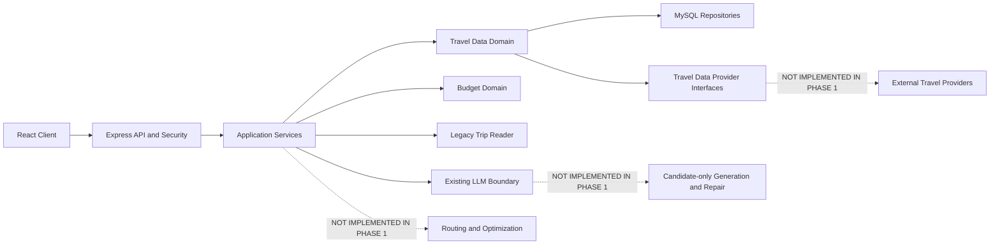
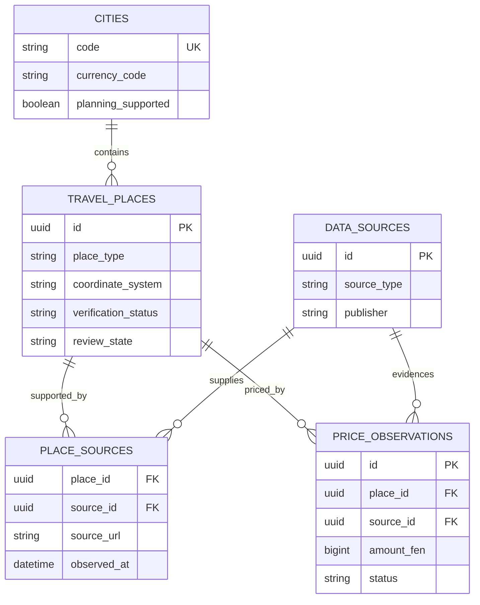
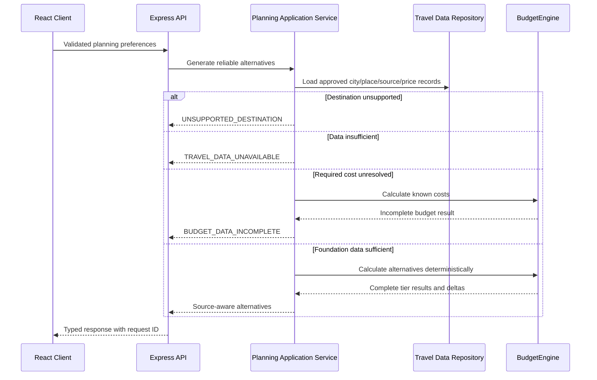

# Nuogo Architecture Rebuild Phase 1 Design

**Status:** Approved design  
**Date:** 2026-08-12  
**Scope:** Authoritative travel data, deterministic budgeting, security hardening, and engineering foundations

## 1. Purpose

Phase 1 replaces the unreliable foundations identified by the current-system audit without rewriting Nuogo. It preserves the React client, Express API, npm workspaces, shared Zod contracts, collaboration and expense features, itinerary aggregate, media safety controls, server-only OpenRouter integration, and bilingual interface.

The central rule is:

> The language model is never the source of travel facts.

New reliable planning will use approved, source-backed records from MySQL. Prices, coordinates, verification state, factual place identities, and canonical budget arithmetic cannot originate from an LLM or demo fixture.

Phase 1 establishes this foundation only. It deliberately stops before external travel-provider integrations, scraping, routing, route optimization, nearby grouping, agency recommendations, and the redesigned candidate-only LLM pipeline.

## 2. Selected Approach

Nuogo will use an **additive compatibility migration**.

The migration runner and authoritative MySQL travel-data model are introduced first. Existing callers are moved behind focused application, domain, repository, and provider boundaries in small changes. SQL.js and fabricated demo facts leave the live path only after their callers have migrated. Existing user trips, collaboration records, and expense records are retained.

This approach was selected over:

- a big-bang replacement, which would create an unnecessarily large regression surface;
- a dual-write transition, which would add reconciliation complexity and preserve two competing data authorities.

The implementation must not reorganize the repository merely to resemble a theoretical architecture. Existing folders remain unless a focused extraction is required by a verified responsibility.

## 3. Architectural Shape

Nuogo remains a modular monolith.



Responsibilities flow in one direction:

1. Routes authenticate, validate transport input, invoke one application use case, and serialize a response.
2. Application services coordinate repositories, domains, and providers.
3. Domain modules enforce travel-data and budget rules without depending on Express or MySQL.
4. Repositories persist and retrieve authoritative records.
5. Provider interfaces define future external acquisition boundaries without pretending that integrations exist.

No microservices, message queues, CQRS, or speculative enterprise abstractions are introduced.

## 4. Database Authority and Migrations

### 4.1 Sole authority

MySQL becomes the sole authoritative production store for travel data. SQL.js is removed from the live application and ingestion path. If preserving useful local records is warranted, a one-time explicit import command may read the old SQLite file and write classified records to MySQL. It must not become a second runtime repository mode.

The existing memory repository remains available only for isolated unit tests and deterministic fixtures. It is not an authoritative production travel catalogue.

### 4.2 Migration runner

The server will provide a deterministic migration runner with:

- `schema_migrations` containing migration name, checksum, and application timestamp;
- `npm run db:migrate` to apply pending migrations in filename order;
- `npm run db:status` to report applied, pending, and checksum-mismatch states;
- an exclusive MySQL advisory lock so concurrent runners cannot apply the same migration;
- checksum verification that fails if an already-applied migration file was edited;
- clear failure output without exposing credentials.

Runtime startup may verify migration state, but it must never mutate schema. Because MySQL DDL is not universally transactional, each migration is designed to be safely re-run or stopped at a recorded boundary instead of promising impossible all-or-nothing DDL behavior.

### 4.3 Data safety

Schema evolution is additive first. Existing user, trip, membership, invitation, collaboration, activity-log, expense, and settlement data must not be wiped. Obsolete tables can be removed only after no live code depends on them and preservation requirements have been satisfied.

## 5. Authoritative Travel-Data Model

### 5.1 Cities

`cities` defines the reliable planning scope. Phase 1 seeds exactly these supported city codes:

| Code | English name | Chinese name | Currency |
|---|---|---|---|
| `BEIJING` | Beijing | 北京 | `CNY` |
| `SHANGHAI` | Shanghai | 上海 | `CNY` |
| `XIAN` | Xi'an | 西安 | `CNY` |

New planner requests for any other destination return `UNSUPPORTED_DESTINATION`. Historical trips for Anhui or other locations remain readable.

### 5.2 Places

`travel_places` stores authoritative place identity and classification:

- stable place ID and city ID;
- bilingual names and descriptions where known;
- type: `ATTRACTION`, `HOTEL`, or `RESTAURANT`;
- latitude and longitude, both nullable;
- coordinate system: `GCJ02` or `WGS84`, required whenever coordinates exist;
- verification status;
- administrative review state and audit fields;
- active/inactive state and timestamps.

A purportedly verified itinerary entity must reference a `travel_places` record. `sourceAttractionId` or its replacement is not optional for verified factual entities.

### 5.3 Sources and provenance

`data_sources` records source identity, source type, publisher, base URL, terms/reference notes, and active state. `place_sources` connects a place to a source with the source URL or external identifier, retrieval/reference timestamp, evidence notes, and source-specific metadata.

Verification states are:

- `LIVE_SOURCE`
- `REFERENCE_VERIFIED`
- `DATABASE_CURATED`
- `UNVERIFIED`
- `LEGACY_UNVERIFIED`

Administrative review states are:

- `PENDING`
- `APPROVED`
- `REJECTED`

Approved records retain `reviewed_at` and `reviewed_by`. A record cannot be treated as source-backed unless its required source relationship exists. LLM output can never assign or elevate verification status.

### 5.4 Price observations

`price_observations` stores observations rather than a timeless price field. Each observation includes:

- place and source references;
- price category and optional traveller category;
- amount in integer fen and `CNY` currency;
- observation or validity timestamps;
- source URL/reference and notes;
- verification/review state where applicable.

Unknown prices are represented as `NULL` or an explicit `UNKNOWN` state. They are never represented as zero. A genuine free price must be explicitly observed as zero with source metadata.



## 6. Repository and Provider Boundaries

The travel-data domain exposes focused repository interfaces for cities, places, provenance, and price observations. Application services depend on these interfaces, not on MySQL statements.

Future provider ports describe capabilities such as place discovery and price observation import. Phase 1 provides interfaces and explicit unavailable results only. It does not create fake provider implementations or adapters labelled as real integrations.

Test fixtures may implement repository/provider interfaces with clearly synthetic records. Fixtures must never be loaded by production startup or returned as verified facts.

## 7. Traveller and Budget Domain

### 7.1 Traveller input

Planner preferences add:

- `adultCount`: integer, minimum 1;
- `childCount`: integer, minimum 0.

`travellerCount` is derived as `adultCount + childCount`. Group totals and average-per-person values use this count.

### 7.2 Canonical categories

The backend `BudgetEngine` owns all canonical calculations for:

- accommodation;
- food;
- attractions;
- transportation;
- other expenses.

The engine accepts normalized integer-fen inputs and returns:

```text
knownTotalFen
budgetDifferenceFen
averagePerPersonFen
isComplete
missingCategories
categoryBreakdown
```

All arithmetic uses integers. Unknown transportation, accommodation, or another required amount produces an unresolved category and `isComplete: false`. It never silently contributes `0`.

The client displays server-calculated results and does not maintain a competing canonical calculator.

### 7.3 Alternative contracts

New alternatives replace the old `budget`, `food`, and `leisure` themes:

| Contract | Rule |
|---|---|
| `BUDGET_SAFE` | Complete known total must be less than or equal to the user's budget. |
| `BALANCED` | Complete known total must be less than or equal to 110% of the user's budget using integer arithmetic. |
| `PREMIUM` | May exceed the budget, but must expose the exact positive or negative difference. |

An incomplete budget cannot be represented as satisfying a hard tier. When authoritative data cannot meet a constraint, the system returns `BUDGET_DATA_INCOMPLETE` or `CONSTRAINT_UNSATISFIED` instead of fabricating a cheaper itinerary.

The model may explain differences between alternatives. It cannot provide canonical costs, category totals, coordinates, factual entities, or verification labels.

## 8. Generation Boundary in Phase 1

Phase 1 removes model/demo facts from the reliable live path but does not build the future AI planner. A reliable request follows this boundary:



Until later provider ingestion supplies enough approved data, a supported city may return `TRAVEL_DATA_UNAVAILABLE`. Being a supported destination does not imply fabricated seed data is sufficient for production planning.

## 9. Legacy Compatibility

Historical trips remain readable, including trips outside the three-city scope. Existing AI/demo factual content is classified as `LEGACY_UNVERIFIED` and never silently promoted.

Compatibility readers may map old style values for display, but new writes use only `BUDGET_SAFE`, `BALANCED`, and `PREMIUM`. Legacy cost fields may be shown as historical estimates with a clear unverified label; they are not recalculated as authoritative values unless every required source-backed input exists.

The migration must preserve collaboration and expense behavior for historical trips. Editing a legacy record must not accidentally mark its old facts as verified.

## 10. Security Design

### 10.1 Authentication

- Production startup requires an explicit JWT secret at least 32 characters long.
- Development without an explicit secret receives a cryptographically random, process-local ephemeral secret and emits a non-sensitive warning.
- Guest login is enabled only in an explicit development/demo environment.
- Every guest request creates a unique isolated principal; no shared guest email or account is reused.
- Production guest authentication is disabled.
- `/planner`, `/compare/:tripId`, `/trip/:tripId`, and `/archive` are protected client routes that preserve an intended return path through login.

### 10.2 Favorite authorization

Creating a favorite requires access to the trip containing the activity. The server derives the activity-trip relationship and checks the current user's trip access; it never trusts a client-supplied owner or trip identity. Repository implementations and tests must prove cross-user activity IDs cannot disclose private snapshots.

### 10.3 Public shares

Public shares use cryptographically secure opaque tokens. The database stores only a one-way token hash. A share includes creation, expiry, revocation, and active-state fields.

- Default expiry is configurable and defaults to seven days.
- Owners can list and revoke their shares.
- Expired or revoked shares return `NOT_FOUND` to avoid unnecessary token-state disclosure.
- The public DTO contains itinerary presentation data only. It excludes member records, invitations, expense details, settlements, private activity logs, email addresses, token hashes, repository metadata, and internal security fields.
- Existing permanent/plaintext shares migrate to a controlled inactive legacy state and are not left permanently valid.

### 10.4 Secret handling

`.env.example` contains placeholders only. Logs and API errors must not expose credentials, authorization headers, JWTs, invitation/share tokens, database connection strings, OpenRouter prompts, or full model responses.

## 11. Errors, Logging, and Request IDs

The API uses a stable error envelope with these codes:

- `VALIDATION_ERROR`
- `AUTHENTICATION_REQUIRED`
- `FORBIDDEN`
- `NOT_FOUND`
- `UNSUPPORTED_DESTINATION`
- `TRAVEL_DATA_UNAVAILABLE`
- `BUDGET_DATA_INCOMPLETE`
- `CONSTRAINT_UNSATISFIED`
- `EXTERNAL_PROVIDER_UNAVAILABLE`
- `INTERNAL_ERROR`

Expected domain errors map to explicit HTTP statuses and bilingual client copy. Unexpected errors are logged server-side and returned as a generic `INTERNAL_ERROR`, with no raw exception message.

Every request accepts a syntactically valid inbound `X-Request-Id` or receives a generated ID. The response echoes it. A maintained structured logger records request ID, method, route, status, duration, environment, and sanitized error metadata. It redacts known secret headers and fields.

## 12. Focused Frontend Changes

The visual design is frozen for this phase. Frontend work is limited to required behavior:

- destination choices limited to Beijing, Shanghai, and Xi'an for new plans;
- adult and child controls;
- `Budget-Safe`, `Balanced`, and `Premium` labels in English and Chinese;
- exact budget difference, per-person cost, completeness, and unresolved categories;
- `LEGACY_UNVERIFIED` and provenance indicators;
- protected route redirects and return behavior;
- generic, honest generation loading without simulated percentages or fixed fake timing;
- share expiry/revocation controls where sharing is exposed;
- removal or renaming of misleading guide and route-optimization claims.

The existing `guide` content, if retained, is renamed as visit guidance/tips and cannot imply a real tour-guide recommendation. Straight polylines may remain as simple location connections only if labelled honestly; they cannot be called optimized routes or navigation.

## 13. Engineering Quality

### 13.1 Lint and type checking

The root adds real commands:

- `npm run lint` using ESLint across client, server, shared code, and relevant scripts;
- `npm run typecheck` using TypeScript `checkJs` and targeted JSDoc for the existing JavaScript codebase.

The project is not converted to TypeScript. Legacy type issues are fixed or covered by narrow, documented boundaries; checking is not globally disabled and no command is a placeholder.

### 13.2 Continuous integration

GitHub Actions uses the committed npm lockfile and runs:

1. install;
2. lint;
3. typecheck;
4. unit/component/API tests;
5. production build;
6. MySQL migration and repository integration tests against an isolated CI MySQL service.

Ordinary tests require no production secrets or external providers.

### 13.3 MySQL integration testing

Local live-MySQL tests are explicitly opt-in through `TEST_DATABASE_URL`. This workstation currently has neither a MySQL CLI nor Docker, so absence of that variable causes a clearly reported skip rather than contact with a developer or production database. CI supplies an isolated MySQL service and must prove:

- an empty database can run all migrations;
- a second migration run is safe;
- supported cities exist;
- place/source/price relationships work;
- database constraints reject invalid records;
- representative repository transactions commit and roll back correctly.

### 13.4 Dependency security

`npm audit` and `npm audit --omit=dev` are reviewed. Compatible secure updates are accepted only after tests and build pass. Breaking major upgrades are not applied blindly. Remaining advisories are documented with package, severity, production/development scope, reason, and mitigation.

## 14. Test Strategy

Meaningful changes follow red-green-refactor:

1. write or update a focused failing test;
2. run it and confirm the intended failure;
3. implement the minimum behavior;
4. run focused tests;
5. run the broader relevant suite;
6. commit the independently reviewable change.

Required coverage includes:

- Beijing, Shanghai, and Xi'an accepted; another new destination rejected;
- integer-fen arithmetic without floating-point drift;
- unknown price and transport distinct from zero;
- `BUDGET_SAFE` hard maximum;
- `BALANCED` integer 110% maximum;
- `PREMIUM` transparent difference;
- verified records require provenance;
- unknown records are not automatically verified;
- model output cannot assign verification status;
- insecure production JWT configuration rejected;
- guest identities unique and unavailable in production;
- favorite IDOR blocked;
- share expiry and revocation enforced;
- public share DTO excludes private fields;
- protected client routes preserve navigation intent;
- empty-database migrations and safe re-runs;
- place/source/price relationships and constraints;
- historical unverified trips remain readable and unverified.

Tests that exist only to enforce intentionally deleted false behavior, such as a 55% fabricated discount, are replaced with meaningful invariant tests rather than retained.

## 15. Implementation Sequence

Implementation follows this dependency order, with small adjustments allowed only when repository dependencies require them:

1. Record baseline tests, build, audits, and repository state.
2. Add the migration runner.
3. Add the authoritative travel-data schema and supported cities.
4. Add source, provenance, verification, review, and price-observation repositories.
5. Remove SQL.js as a live data authority.
6. Restrict new planner scope to the three supported cities.
7. Add adult/child traveller contracts.
8. Add the deterministic `BudgetEngine`.
9. Replace alternative contracts and remove fake cost/discount/guide behavior.
10. Add explicit legacy classification and compatibility reading.
11. Harden JWT and isolated development guests.
12. Fix favorite authorization.
13. Add expiring, revocable, hash-backed public shares and a public DTO.
14. Protect private client routes.
15. Add typed errors, structured logging, and request IDs.
16. Add lint and genuine JavaScript static checking.
17. Add CI and opt-in MySQL integration tests.
18. Apply compatible dependency-security updates and document residual risk.
19. Create Phase 1 architecture, database, and security documentation and correct outdated claims.
20. Run complete verification and evaluate every invariant.

## 16. Documentation Deliverables

Implementation creates or updates:

- `ARCHITECTURE_FOUNDATION_PHASE1.md`;
- `DATABASE_SCHEMA_PHASE1.md`;
- `SECURITY_BASELINE_PHASE1.md`;
- API documentation and environment setup where contracts change;
- current architecture/audit documents whose claims become outdated.

Mermaid diagrams must reflect implemented behavior. Future routing, external provider, agency, and new LLM work is labelled `NOT IMPLEMENTED IN PHASE 1`.

## 17. Explicit Non-Goals

Phase 1 does not implement:

- Ctrip, Trip.com, Ly.com, AMap, Baidu, or other external provider adapters;
- website scraping or agency import;
- route directions, optimization, matrices, or nearby clustering;
- drag-and-drop candidate selection;
- tour-guide or travel-agency recommendation;
- a new LLM prompt architecture, JSON Schema enforcement, semantic repair loop, or diversity algorithm;
- opening-hours feasibility or live foreign-exchange conversion;
- a broad frontend redesign;
- a full TypeScript conversion.

## 18. Completion and Verification

Final verification runs at minimum:

```text
npm test
npm run build
npm run lint
npm run typecheck
npm audit
npm audit --omit=dev
npm run db:status
npm run db:migrate
```

The live MySQL migration/integration suite is also run when `TEST_DATABASE_URL` is available and always configured in CI. Results report exact before/after test counts, pass/fail/skip totals, build result, lint result, typecheck result, audit findings, migration result, and database integration result.

Phase 1 is `COMPLETE` only if every authoritative invariant in the rebuild brief is satisfied. Local infrastructure absence is reported honestly; it does not justify claiming an unexecuted check passed. Any unmet invariant changes the verdict to `PARTIALLY COMPLETE` or `BLOCKED`.

After the Phase 1 report, work stops. External providers, routing, route optimization, the new LLM architecture, drag-and-drop, and agencies require separate approved phases.
